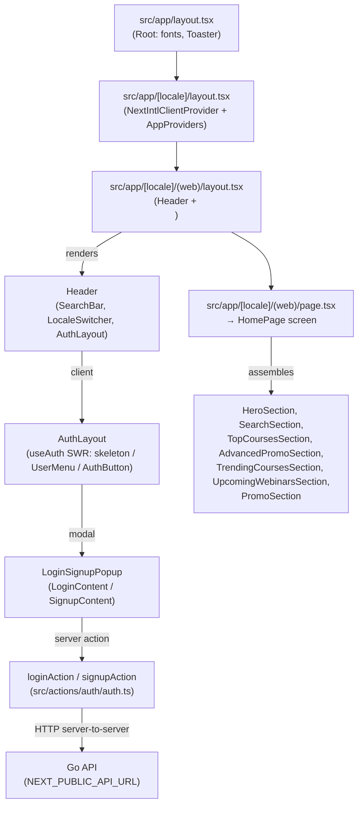

# Frontend Architecture (`fe`)

This document describes how the **MyCourse** Next.js application is structured, including its technology stack, directory layout, functional clusters, design decisions, and cross-cutting concerns. It reflects the knowledge graph for repo **`fe`** (clusters: **Ui**, **Api**, **Auth**, 336 symbols across 118 files as of last index).

---

## Technology Stack

| Layer | Technology | Version | Notes |
|-------|-----------|---------|-------|
| Framework | Next.js (App Router) | 16.2.1 | Server Components, Server Actions, Middleware |
| UI library | React | 19.2.4 | Concurrent features, `use client` / `use server` boundary |
| Styling | Tailwind CSS | 4.x | PostCSS plugin (`@tailwindcss/postcss`) |
| Component primitives | Radix UI | various | Headless: Avatar, Checkbox, Dialog, DropdownMenu, Separator, Slot |
| Design system | shadcn | 4.x | Config at `components.json`; primitives live in `src/components/ui/` |
| Forms | react-hook-form + zod | 7.x / 4.x | `@hookform/resolvers` bridges the two |
| i18n | next-intl | 4.x | Locales `en` and `vi`, `localePrefix: "always"` |
| Data fetching (client) | SWR | 2.x | Global config in `AppProviders`; `revalidateOnFocus: false`, 30 s dedup |
| HTTP client | Axios | 1.x | Shared instance with request/response interceptors |
| Global state | Zustand | 5.x | Provider-free stores |
| Toasts | Sonner | 2.x | Mounted in root layout, `position: "top-right"` |
| Cookies (client) | js-cookie | 3.x | Read/write in browser context; `next/headers` used server-side |
| Icons | lucide-react | 1.x | |
| Type checker | TypeScript | 5.x | Strict mode |
| Linter / formatter | ESLint 9 + Biome 2 | — | Two toolchains: ESLint for Next rules, Biome for formatting |
| Commit lint | commitlint | 20.x | Conventional Commits via `lint:commit` script |

### Fonts

Loaded in `src/lib/font.ts` via `next/font/google` and applied as CSS variables in the root layout:

| Variable | Font | Usage |
|----------|------|-------|
| `--font-roboto` | Roboto | Body text (default via `font-roboto` class) |
| `--font-gilroy` | Gilroy (via local or Google) | Headings / display |
| `--font-geist-mono` | Geist Mono | Code / monospace |

---

## High-Level Request Flow

```
Browser
  └─ DNS → Nginx (TLS termination)
              └─ 127.0.0.1:3000 → next start (PM2: mycourse-web)
                    ├─ Middleware (src/proxy.ts) → locale redirect
                    ├─ App Router layout tree
                    │     ├─ Root layout (fonts, Toaster)
                    │     ├─ [locale] layout (NextIntlClientProvider + AppProviders)
                    │     └─ (web) layout (Header + main)
                    │           └─ HomePage / future pages
                    └─ Server Actions → NEXT_PUBLIC_API_URL (Go API on :8080)
```

---

## App Router Layout Hierarchy



---

## Directory Map

```
fe/
├── src/
│   ├── app/                        # Next.js App Router
│   │   ├── layout.tsx              # Root layout — fonts, Toaster
│   │   ├── page.tsx                # / → redirect to /vi
│   │   └── [locale]/
│   │       ├── layout.tsx          # Locale layout — NextIntlClientProvider + AppProviders
│   │       └── (web)/
│   │           ├── layout.tsx      # Web shell — Header + <main>
│   │           └── page.tsx        # Home route → HomePage
│   │
│   ├── screen/                     # Page-level screen components (async server components)
│   │   └── home/page.tsx           # HomePage — assembles all home sections
│   │
│   ├── components/
│   │   ├── ui/                     # Radix/shadcn primitives (Button, Dialog, Input, …)
│   │   ├── common/
│   │   │   ├── header/             # Header, LocaleSwitcher
│   │   │   ├── footer/             # Footer (available; not yet in web layout)
│   │   │   └── auth-menu/          # AuthLayout, AuthButton, LoginSignupPopup,
│   │   │                           # LoginContent, SignupContent, UserMenu,
│   │   │                           # auth-form-handler.ts, auth-social-login/
│   │   ├── home/                   # Home page sections (HeroSection, CourseCard, …)
│   │   ├── shared/                 # Cross-feature components (SearchBar, …)
│   │   ├── providers/
│   │   │   └── app-providers.tsx   # SWRConfig wrapper
│   │   └── demo/
│   │       └── register-form.tsx   # Demo/sandbox form (not wired to a route)
│   │
│   ├── actions/
│   │   └── auth/auth.ts            # "use server": loginAction, signupAction
│   │
│   ├── api/
│   │   ├── instance.ts             # createApiInstance + singleton apiInstance
│   │   │                           # Interceptors: Bearer token attach, token refresh
│   │   ├── methods.ts              # apiFetch / apiPost / apiPut / apiDelete → ApiResult<T>
│   │   ├── cache.ts                # (DISABLED) Client IndexedDB + server Map cache layer
│   │   ├── callers/
│   │   │   └── auth/auth.ts        # loginService, getMeService, getMeEndpointKey
│   │   └── hooks/
│   │       └── auth/useAuth.ts     # SWR hook: { me, isLoading, error, mutate }
│   │
│   ├── store/
│   │   ├── auth/auth.ts            # useAuthStore — modal state (authAction, nextLink)
│   │   ├── api-error-store.ts      # useApiError — global error accumulation (max 20)
│   │   └── use-app-store.ts        # useAppStore — app-level placeholder
│   │
│   ├── hooks/
│   │   └── auth/useAuthContext.tsx # useAuthContext (modal store), useGetMe (SWR wrapper)
│   │
│   ├── types/
│   │   ├── api.ts                  # ApiResult, ApiResponse, ApiPageInfo, ApiErrorCode
│   │   └── auth/auth.ts            # MeResponse, LoginResponse, RefreshTokenResponse
│   │
│   ├── schema/
│   │   └── auth/auth.ts            # loginSchema, signupSchema (Zod + i18n keys)
│   │
│   ├── constants/
│   │   ├── api-route.ts            # API_PUBLIC_ROUTES, API_PRIVATE_ROUTES
│   │   ├── route.ts                # PUBLIC_ROUTES (client-side navigation paths)
│   │   └── common.ts               # HEADER_DROPDOWN_ITEMS, LANGUAGE_OPTIONS
│   │
│   ├── lib/
│   │   ├── utils.ts                # cn(), buildQueryParams(), cookie helpers,
│   │   │                           # getCookieDomain(), buildCookieOptions(), pickCharacter()
│   │   ├── font.ts                 # next/font definitions (Roboto, Gilroy, GeistMono)
│   │   └── http.ts                 # (placeholder / future HTTP utilities)
│   │
│   ├── config/
│   │   ├── load-config.ts          # Dynamic config loader (extend as needed)
│   │   └── items/items-config.ts   # Feature flag / item config
│   │
│   ├── i18n/
│   │   ├── routing.ts              # defineRouting — locales, defaultLocale, localePrefix
│   │   ├── request.ts              # getRequestConfig — message loading per locale
│   │   └── navigation.ts          # next-intl navigation helpers (Link, redirect, …)
│   │
│   ├── messages/
│   │   ├── en.json                 # English translations
│   │   └── vi.json                 # Vietnamese translations (default locale)
│   │
│   └── proxy.ts                    # next-intl middleware + matcher
│                                   # ⚠️ Must be renamed/re-exported as src/middleware.ts
│
├── docs/
│   ├── architecture.md             # This file
│   ├── deploy.md                   # Production deployment runbook
│   ├── flow.md                     # Auth and API execution flows
│   └── screens.md                  # Routes and UI surfaces
│
├── public/                         # Static assets (icons, images)
├── next.config.ts                  # Next.js config + next-intl plugin
├── components.json                 # shadcn configuration
├── biome.json                      # Biome linter/formatter config
└── package.json
```

---

## Functional Clusters (GitNexus)

The graph groups the codebase into three cohesive modules:

### `Auth` cluster — 15 symbols, 79% cohesion

Covers everything related to authentication UI and server-side token management:

| Symbol | File | Role |
|--------|------|------|
| `LoginContent` | `auth-menu/auth/login-content.tsx` | Login form (react-hook-form + zodResolver) |
| `SignupContent` | `auth-menu/auth/signup-content.tsx` | Signup form (react-hook-form + zodResolver) |
| `LoginSignupPopup` | `auth-menu/auth/login-signup-popup.tsx` | Dialog that switches between login/signup tabs |
| `AuthButton` | `auth-menu/auth-button.tsx` | CTA button shown when not authenticated |
| `AuthLayout` | `auth-menu/auth-layout.tsx` | Header chrome: skeleton / `UserMenu` / `AuthButton` |
| `UserMenu` | `auth-menu/user-menu.tsx` | Avatar dropdown for authenticated users |
| `handleAuthSubmit` | `auth-menu/auth/auth-form-handler.ts` | Shared dispatcher → `loginAction` / `signupAction` |
| `loginAction` | `actions/auth/auth.ts` | `"use server"` — calls loginService, sets cookies |
| `signupAction` | `actions/auth/auth.ts` | `"use server"` — placeholder (not yet implemented) |
| `loginSchema` / `signupSchema` | `schema/auth/auth.ts` | Zod schemas with i18n error keys |
| `useAuthStore` | `store/auth/auth.ts` | Auth modal state (authAction, nextLink) |
| `useAuthContext` / `useGetMe` | `hooks/auth/useAuthContext.tsx` | Convenience wrappers for store + SWR |

### `Api` cluster — 18 symbols, 100% cohesion

All HTTP communication and token lifecycle management:

| Symbol | File | Role |
|--------|------|------|
| `createApiInstance` | `api/instance.ts` | Axios instance factory with interceptors |
| `apiInstance` | `api/instance.ts` | Singleton shared by all callers |
| `doTokenRefresh` | `api/instance.ts` | Raw Axios refresh call (bypasses interceptors) |
| `scheduleAfterRefresh` / `flushRefreshQueue` | `api/instance.ts` | Client-side mutex queue |
| `apiFetch` / `apiPost` / `apiPut` / `apiDelete` | `api/methods.ts` | Low-level helpers → `ApiResult<T>` |
| `getMeService` | `api/callers/auth/auth.ts` | `GET /api/v1/me` → `MeResponse \| null` |
| `loginService` | `api/callers/auth/auth.ts` | `POST /api/v1/auth/login` |
| `useAuth` | `api/hooks/auth/useAuth.ts` | SWR hook for current user |
| `useApiError` | `store/api-error-store.ts` | Global error store (max 20 entries) |
| `ApiResult<T>` / `ApiResponse<T>` | `types/api.ts` | Shared envelope types |

### `Ui` cluster — 51 symbols, 95% cohesion

Design-system primitives and presentational components:

| Area | Files |
|------|-------|
| Radix/shadcn primitives | `Button`, `Dialog`, `Input`, `InputGroup`, `Field`, `Label`, `Textarea`, `Checkbox`, `Avatar`, `Badge`, `Card`, `Separator`, `DropdownMenu` |
| Layout utilities | `cn()` (clsx + tailwind-merge), `buildQueryParams()` |
| Home sections | `HeroSection`, `SearchSection`, `TopCoursesSection`, `AdvancedPromoSection`, `TrendingCoursesSection`, `UpcomingWebinarsSection`, `PromoSection`, `CourseCard` |
| Header / global | `Header`, `LocaleSwitcher`, `SearchBar` |

---

## Key Design Decisions

### 1. Server Actions for Login — Privacy by Default

Login and signup calls are proxied through Next.js Server Actions (`"use server"`). The browser's network panel never sees the Go API endpoint or the raw token exchange. This also lets the server relay `Set-Cookie` headers back to the browser reliably.

### 2. Non-HttpOnly Cookies — Client-Readable Tokens

Auth tokens (`access_token`, `refresh_token`, `session_id`) are stored as **non-HttpOnly**, `SameSite=Lax` cookies so the client-side Axios interceptor can read them and attach them as HTTP headers on every request (`Authorization: Bearer …`, `X-Refresh-Token`, `X-Session-Id`). `buildCookieOptions` enforces `secure: true` in production.

### 3. Isomorphic Cookie Layer

`getCookieValue` / `setCookieValue` in `src/lib/utils.ts` transparently switch between `js-cookie` (browser) and `next/headers` (server). This allows the same Axios interceptor logic to run in both RSC/Server Action and browser contexts without code duplication.

### 4. Token Refresh Mutex (Client Only)

When multiple concurrent client requests receive `401 + X-Token-Expired: true` simultaneously, only **one** refresh call is issued. All others are queued via a `pendingResolvers` array and receive the new token once the single refresh completes. Server-side requests are isolated per user and do not use this mutex.

### 5. SWR for Current User

`useAuth` uses SWR to cache the `GET /api/v1/me` response. `revalidateOnFocus: false` and a 30-second dedup interval prevent unnecessary refetches. After a successful login, the caller invokes `mutate()` to force an immediate revalidation.

### 6. Zustand for UI State

Auth modal state (`authAction: "none" | "login" | "signup" | "logout"`) and API error accumulation live in provider-free Zustand stores. Any component can import the hook directly without a wrapping Provider.

### 7. API Response Envelope

All Go API endpoints return a standard `{ code, message, data }` envelope (mirroring `be/pkg/response/response.go`). `code === 0` means success; any other value is an application error. The `ApiErrorCode` constant map in `src/types/api.ts` mirrors `be/pkg/errcode/codes.go`.

---

## Environment Variables

| Variable | Required | Set at | Description |
|----------|----------|--------|-------------|
| `NEXT_PUBLIC_API_URL` | **Yes** | Build + runtime | Base URL of the Go API (e.g. `https://api.yourdomain.net`). Inlined at `next build`. |
| `AUTH_COOKIE_DOMAIN` | Prod only | Server runtime | Parent domain for auth cookies when FE and API are on separate subdomains (e.g. `yourdomain.net`). Passed to `getCookieDomain()` → included in `buildCookieOptions()`. Leave unset on localhost. |
| `API_URL` | Fallback | Server runtime | Server-side fallback for `NEXT_PUBLIC_API_URL` in pure SSR contexts (not prefixed, so never inlined into client bundle). |

---

## Internationalization

| File | Role |
|------|------|
| `src/i18n/routing.ts` | `defineRouting` — locales `["en","vi"]`, `defaultLocale: "vi"`, `localePrefix: "always"` |
| `src/i18n/request.ts` | `getRequestConfig` — lazily imports `src/messages/{locale}.json` |
| `src/i18n/navigation.ts` | Typed `Link`, `redirect`, `useRouter`, `usePathname` from `next-intl/navigation` |
| `src/messages/en.json` | English copy |
| `src/messages/vi.json` | Vietnamese copy (default locale) |
| `next.config.ts` | `createNextIntlPlugin("./src/i18n/request.ts")` wraps the Next config |

Validation error messages in Zod schemas (`loginSchema`, `signupSchema`) use **i18n keys** (e.g. `"validation.email"`). Components call `t(error.message)` to resolve them via `useTranslations("auth")`.

---

## Middleware: Locale Routing

`src/proxy.ts` exports the `next-intl` middleware (`createMiddleware(routing)`) and a `config.matcher`. **Next.js only loads middleware from a file named `middleware.ts`** (at project root or under `src/`). Until `src/proxy.ts` is renamed to `src/middleware.ts` (or a re-export bridge is added), locale-prefix redirects will not run.

**Current status:** This file must be renamed before deployment to ensure `/vi`, `/en` locale enforcement works.

---

## API Routes

```ts
// src/constants/api-route.ts
API_PUBLIC_ROUTES.auth.login    → POST /api/v1/auth/login
API_PUBLIC_ROUTES.auth.signup   → POST /api/v1/auth/signup
API_PUBLIC_ROUTES.auth.refresh  → POST /api/v1/auth/refresh

API_PRIVATE_ROUTES.user.getMe   → GET  /api/v1/me
```

All paths use the `NEXT_PUBLIC_API_URL` base URL (via `apiInstance`).

---

## Caching Layer (Temporarily Disabled)

`src/api/cache.ts` implements a dual-layer cache:
- **Client:** IndexedDB (persists across page reloads within TTL)
- **Server:** Module-level `Map` (in-process, per-worker)

The cache integration in `apiFetch` is currently commented out (`// TODO: re-enable`). Default baseline TTL is 1 second; callers can pass `caching: { ttlSeconds: N }` or `caching: false`.

---

## Related Docs

| Doc | Contents |
|-----|----------|
| [`docs/flow.md`](flow.md) | Auth and API execution flows with sequence diagrams |
| [`docs/screens.md`](screens.md) | App Router routes, layouts, and UI surfaces |
| [`docs/deploy.md`](deploy.md) | Production deployment runbook (Ubuntu 24.04, PM2, Nginx, TLS) |
| [`../be/docs/deploy.md`](../../be/docs/deploy.md) | Full-stack VPS: Go API, Postgres, Redis, joint Nginx |
