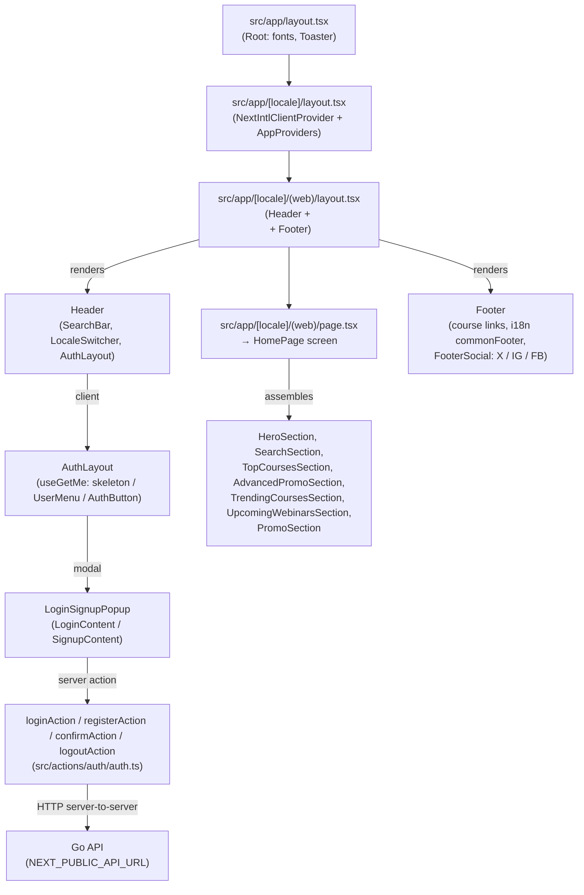

# Frontend Architecture (`fe-mycourse`)

_Last audited: 2026-05-27 (jscpd excludes shadcn `src/components/ui/**`; CI `quality:deps` on `dev`)._


This document describes how the **MyCourse** Next.js application is structured, including its technology stack, directory layout, functional clusters, design decisions, and cross-cutting concerns. GitNexus index **`fe-mycourse`** (2026-05-21): **~219** files under `src/`, **1570** symbols, **3189** relationships, **69** execution flows, **27** clusters. Refresh: `npx gitnexus analyze --force` from repo root.

---

## Technology Stack

| Layer | Technology | Version | Notes |
|-------|-----------|---------|-------|
| Framework | Next.js (App Router) | 16.2.1 | Server Components, Server Actions, Middleware |
| UI library | React | 19.2.4 | Concurrent features, `use client` / `use server` boundary |
| Styling | Tailwind CSS | 4.x | PostCSS plugin (`@tailwindcss/postcss`) |
| Component primitives | Radix UI (`radix-ui` + legacy `@radix-ui/*`) | various | Headless primitives; shadcn v4 batch uses unified `radix-ui` package |
| Design system | shadcn | 4.2.0 | `components.json` style `radix-nova`; **54** files under `src/components/ui/`; **no Base UI**; full catalog except Combobox |
| Charts / carousel / calendar | recharts, embla-carousel-react, react-day-picker | 3.x / 8.x / 10.x | Installed via shadcn `chart`, `carousel`, `calendar` |
| DnD / tree | @dnd-kit/*, @nosferatu500/react-sortable-tree | 6.x / 5.x | npm install only; no app wrappers yet |
| Forms | react-hook-form + zod | 7.x / 4.x | `@hookform/resolvers` bridges the two |
| i18n | next-intl | 4.x | Locales `en` and `vi`, `localePrefix: "always"` |
| Data fetching (client) | SWR | 2.x | Shared `SWRConfig` in `AppProviders` (`revalidateOnFocus: false`, 30 s dedup) for hooks under the provider; `useAuth` sets its own SWR options |
| HTTP client | Axios | 1.x | Shared instance with request/response interceptors |
| Global state | Zustand | 5.x | Provider-free stores (auth, me, stream event log) |
| Realtime (client) | BroadcastChannel, SSE, WebSocket, NDJSON fetch | — | See [`docs/delivery.md`](./delivery.md) |
| Stream libraries | `reconnecting-websocket`, `@microsoft/fetch-event-source` | 4.x / 2.x | Transports in `src/events/` |
| Toasts | Sonner | 2.x | Mounted in root layout, `position: "top-right"` |
| Cookies (client) | js-cookie | 3.x | Read/write in browser context; `next/headers` used server-side |
| Icons | lucide-react | 1.x | |
| Type checker | TypeScript | 5.x | Strict mode |
| Linter / formatter | ESLint 9 + Biome 2 | — | Two toolchains: ESLint for Next rules, Biome for formatting |
| Commit lint | commitlint | 20.x | Conventional Commits via `lint:commit` script |
| Dependency graph | madge | 8.x | `npm run cycles` — circular static imports in `src/`; CI via `quality:deps` |
| Clone detection | jscpd | 4.x | `npm run dupl` — `.jscpd.json` (excludes `src/components/ui/**`); CI via `quality:deps` |

### Fonts

Loaded in `src/lib/font.ts` via `next/font/google` and applied as CSS variables in the root layout:

| Variable | Font | Usage |
|----------|------|-------|
| `--font-roboto` | Roboto | Body text (default via `font-roboto` class) |
| `--font-gilroy` | Gilroy (via local or Google) | Headings / display |
| `--font-geist-mono` | Geist Mono | Code / monospace |

---

## High-Level Request Flow

```
Browser
  └─ DNS → Nginx (TLS termination)
              └─ 127.0.0.1:3000 → next start (PM2: e.g. `mycourse-web` or `mycourse-web-dev` per `ecosystem.config.cjs`)
                    ├─ Middleware (src/proxy.ts) -> locale redirect
                    ├─ App Router layout tree
                    │     ├─ Root layout (fonts, Toaster)
                    │     ├─ [locale] layout (NextIntlClientProvider + AppProviders)
                    │     └─ (web) layout (Header + main + Footer)
                    │           └─ HomePage / future pages
                    └─ Server Actions → NEXT_PUBLIC_API_URL (Go API on :8080)
```

---

## App Router Layout Hierarchy



---

## Directory Map

```
fe/
├── src/
│   ├── app/                        # Next.js App Router
│   │   ├── layout.tsx              # Root layout — fonts, Toaster
│   │   ├── page.tsx                # / → redirect to /vi
│   │   └── [locale]/
│   │       ├── layout.tsx          # Locale layout — NextIntlClientProvider + AppProviders
│   │       ├── (web)/
│   │       │   ├── layout.tsx      # Web shell — Header, <main>, Footer
│   │       │   └── page.tsx        # Home route → HomePage
│   │       ├── admin/              # DashboardLayout + AdminDashboardPage
│   │       ├── instructor/
│   │       └── sysadmin/
│   │
│   ├── screen/                     # Page-level screen components (async server components)
│   │   ├── index.ts                # Barrel: common + admin + instructor + sysadmin
│   │   ├── common/home/page.tsx    # HomePage
│   │   ├── admin/page.tsx          # AdminDashboardPage
│   │   ├── instructor/page.tsx
│   │   └── sysadmin/page.tsx
│   │
│   ├── components/
│   │   ├── ui/                     # Radix/shadcn primitives (Button, Dialog, Input, …)
│   │   ├── common/
│   │   │   ├── index.ts            # Barrel: auth-menu, dashboard, footer, header
│   │   │   ├── dashboard/          # DashboardLayout (+ locale chrome helpers), DashboardSidebar, DashboardUnauthorized
│   │   │   ├── header/             # Header (RSC), HeaderDashboard, HeaderBrowseNav, HeaderMobileBar/Sidebar,
│   │   │                           # BrowseSidebarMenu, SidebarAuthFooter, LocaleSwitcher
│   │   │   ├── footer/             # Footer (RSC), FooterSocial (client social icons)
│   │   │   └── auth-menu/          # AuthLayout, AuthButton, LoginSignupPopup,
│   │   │                           # LoginContent, SignupContent, UserMenu,
│   │   │                           # auth-form-handler.ts, auth-social-login/
│   │   ├── home/                   # Home page sections (HeroSection, CourseCard, …)
│   │   ├── shared/                 # Cross-feature components (SearchBar, …)
│   │   ├── providers/
│   │   │   └── app-providers.tsx   # SWRConfig, EventsStreamProvider, MeSwrSync, LanguageLocaleSync, auth tab sync
│   │   └── demo/
│   │       └── register-form.tsx   # Demo/sandbox form (not wired to a route)
│   │
│   ├── actions/
│   │   └── auth/auth.ts            # "use server": loginAction, registerAction, confirmAction, logoutAction (+ deprecated signupAction alias)
│   │
│   ├── api/
│   │   ├── index.ts                # Barrel: re-exports api* + raw* + types from instance/methods/raw-http
│   │   ├── instance.ts             # createApiInstance + singleton apiInstance
│   │   │                           # Interceptors: Bearer token attach, token refresh
│   │   ├── methods.ts              # apiFetch / apiPost / apiPut / apiDelete / apiOptions → ApiResult<T>
│   │   ├── raw-http.ts             # rawFetch / rawPost / … plain Axios (used by doTokenRefresh)
│   │   ├── cache.ts                # (DISABLED) Client IndexedDB + server Map cache layer
│   │   ├── callers/
│   │   │   └── auth/auth.ts        # loginService, registerService, confirmService, logoutService, getMeService
│   │   └── hooks/
│   │       └── auth/useAuth.ts     # SWR hook: { me, isLoading, error, mutate }
│   │
│   ├── store/
│   │   ├── auth/auth.ts            # useAuthStore, useMeStore
│   │   ├── language/               # useLanguageStore (languageCode, languageLabel)
│   │   ├── api-error-store.ts      # useApiError
│   │   ├── events/                 # stream event log + per-channel selectors
│   │   └── use-app-store.ts        # useAppStore — placeholder
│   │
│   ├── hooks/
│   │   ├── auth/                   # useAuthStore, useGetMe, useSyncMeFromAuth
│   │   ├── language/               # useCustomLanguage, useSyncLanguageFromLocale
│   │   ├── events/                 # useStreamEvent, per-transport hooks
│   │   └── use-mobile.ts           # useIsMobile
│   │
│   ├── types/
│   │   ├── api.ts                  # ApiResult, ApiResponse, ApiPageInfo, ApiErrorCode
│   │   └── auth/auth.ts            # MeResponse, LoginResponse, RefreshTokenResponse
│   │
│   ├── schema/
│   │   └── auth/auth.ts            # loginSchema, signupSchema (Zod + i18n keys)
│   │
│   ├── constants/
│   │   ├── api-route.ts            # API_PUBLIC_ROUTES, API_PRIVATE_ROUTES
│   │   ├── route.ts                # PUBLIC_ROUTES (home, confirmEmail, logout)
│   │   ├── browse-menu.ts          # BROWSE_MENU_ITEMS
│   │   └── common.ts               # HEADER_DROPDOWN_ITEMS, LANGUAGE_OPTIONS (types: types/user-menu.ts)
│   │
│   ├── lib/
│   │   ├── language/               # resolveCustomLanguage, resolveLanguageCode
│   │   ├── utils/                  # Shared helpers — import `@/lib/utils` (barrel: index.ts)
│   │   │   ├── index.ts            # Re-exports
│   │   │   ├── cn.ts               # cn() (clsx + tailwind-merge)
│   │   │   ├── url.ts              # buildQueryParams()
│   │   │   ├── list-query.ts       # apiListQueryToRecord()
│   │   │   ├── format-bytes.ts     # formatBytes()
│   │   │   ├── media.ts            # media upload/list helpers
│   │   │   ├── react.ts            # useUniqueId()
│   │   │   ├── user.ts             # pickCharacter()
│   │   │   └── cookie.ts           # cookie types, domain, build options, isomorphic get/set
│   │   ├── font.ts                 # next/font definitions (Roboto, Gilroy, GeistMono)
│   │   └── http.ts                 # (placeholder / future HTTP utilities)
│   │
│   ├── config/
│   │   ├── load-config.ts          # Dynamic config loader (extend as needed)
│   │   └── items/items-config.ts   # Feature flag / item config
│   │
│   ├── i18n/
│   │   ├── routing.ts              # defineRouting — locales, defaultLocale, localePrefix
│   │   ├── request.ts              # getRequestConfig — message loading per locale
│   │   └── navigation.ts          # next-intl navigation helpers (Link, redirect, …)
│   │
│   ├── lib/i18n/
│   │   ├── load-messages.ts        # loadMessages / preloadAllMessages
│   │   └── index.ts
│   │
│   ├── messages/
│   │   ├── en.ts                   # English translations (as const)
│   │   ├── vi.ts                   # Vietnamese (satisfies Messages)
│   │   └── types.ts                # Messages type from en.ts
│   │
│   └── proxy.ts                    # next-intl middleware + matcher
│                                   # Locale proxy entry for next-intl routing
│
├── docs/
│   ├── architecture.md             # This file
│   ├── deploy.md                   # Production deployment runbook
│   ├── flow.md                     # Auth and API execution flows
│   └── screens.md                  # Routes and UI surfaces
│
├── public/                         # Static assets (icons, images)
├── next.config.ts                  # Next.js config + next-intl plugin
├── components.json                 # shadcn configuration
├── biome.json                      # Biome linter/formatter config
└── package.json
```

---

## Functional Clusters (GitNexus)

The graph groups the codebase into three cohesive modules:

### `Auth` cluster — 15 symbols, 79% cohesion

Covers everything related to authentication UI and server-side token management:

| Symbol | File | Role |
|--------|------|------|
| `LoginContent` | `auth-menu/auth/login-content.tsx` | Login form (react-hook-form + zodResolver) |
| `SignupContent` | `auth-menu/auth/signup-content.tsx` | Signup form (react-hook-form + zodResolver) |
| `LoginSignupPopup` | `auth-menu/auth/login-signup-popup.tsx` | Dialog that switches between login/signup tabs |
| `AuthButton` | `auth-menu/auth-button.tsx` | CTA button shown when not authenticated |
| `AuthLayout` | `auth-menu/auth-layout.tsx` | Header chrome: skeleton / `UserMenu` / `AuthButton` |
| `UserMenu` | `auth-menu/user-menu.tsx` | Avatar dropdown for authenticated users |
| `handleAuthSubmit` | `auth-menu/auth/auth-form-handler.ts` | Dispatcher → `loginAction` / `registerAction` (UI type `"signup"`) |
| `loginAction` | `actions/auth/auth.ts` | `"use server"` — login, sets cookies |
| `registerAction` | `actions/auth/auth.ts` | `"use server"` — register (201, no cookies until confirm) |
| `confirmAction` | `actions/auth/auth.ts` | `"use server"` — email confirm, sets cookies |
| `logoutAction` | `actions/auth/auth.ts` | `"use server"` — revoke session, clear cookies |
| `signupAction` | `actions/auth/auth.ts` | **Deprecated alias** of `registerAction` |
| `loginSchema` / `signupSchema` | `schema/auth/auth.ts` | Zod schemas with i18n error keys |
| `useAuthStore` | `store/auth/auth.ts` | Auth modal state (authAction, nextLink) |
| `useAuthStore` / `useGetMe` / `useSyncMeFromAuth` | `hooks/auth/use-auth-store.ts` | Auth modal store; `/me` Zustand mirror; SWR sync via `MeSwrSync` |
| `useCustomLanguage` / `useSyncLanguageFromLocale` | `hooks/language/*` | Language label/code store (no React Context) |
| `useLanguageStore` | `store/language/language-store.ts` | `languageCode`, `locale`, `languageLabel` |

### `Api` cluster — 18 symbols, 100% cohesion

All HTTP communication and token lifecycle management:

| Symbol | File | Role |
|--------|------|------|
| `createApiInstance` | `api/instance.ts` | Axios instance factory with interceptors |
| `apiInstance` | `api/instance.ts` | Singleton shared by all callers |
| `doTokenRefresh` | `api/instance.ts` | Calls `rawPost` in `raw-http.ts` for `POST /auth/refresh` (no `apiInstance`) |
| `scheduleAfterRefresh` / `flushRefreshQueue` | `api/instance.ts` | Client-side mutex queue |
| `rawPost` / `rawFetch` / … | `api/raw-http.ts` | Plain Axios helpers → `ApiResult<T>`; imported by `instance.ts` only from here |
| `apiFetch` / `apiPost` / `apiPut` / `apiDelete` / `apiOptions` | `api/methods.ts` | Low-level helpers on `apiInstance` → `ApiResult<T>` |
| `getMeService` | `api/callers/auth/auth.ts` | `GET /api/v1/me` → `MeResponse \| null` |
| `loginService` | `api/callers/auth/auth.ts` | `POST /api/v1/auth/login` |
| `listMediaFiles` / `uploadMediaFiles` / `deleteMediaFile` | `api/callers/media/media.ts` | Media library CRUD (multipart upload, delete by `object_key`) |
| `useMediaFiles` | `api/hooks/media/useMediaFiles.ts` | SWR hook for paginated media list |
| `useAuth` | `api/hooks/auth/useAuth.ts` | SWR hook for current user |
| `useApiError` | `store/api-error-store.ts` | Global error store (max 20 entries) |
| `ApiResult<T>` / `ApiResponse<T>` | `types/api.ts` | Shared envelope types |

### `Ui` cluster — 51 symbols, 95% cohesion

Design-system primitives and presentational components:

| Area | Files |
|------|-------|
| Radix/shadcn primitives | Full set in `src/components/ui/` (54 modules) — see [`docs/components.md`](./components.md) inventory table |
| Layout utilities | `cn()`, `buildQueryParams()`, `apiListQueryToRecord()`, `formatBytes()` |
| Home sections | `HeroSection`, `SearchSection`, `TopCoursesSection`, `AdvancedPromoSection`, `TrendingCoursesSection`, `UpcomingWebinarsSection`, `PromoSection`, `CourseCard` |
| Header / global | `Header`, `HeaderDashboard`, `DashboardLayout`, `LocaleSwitcher`, `SearchBar`, `Footer`, `FooterSocial` |

---

## Key Design Decisions

### 1. Server Actions for Login — Privacy by Default

Login and signup calls are proxied through Next.js Server Actions (`"use server"`). The browser's network panel never sees the Go API endpoint or the raw token exchange. This also lets the server relay `Set-Cookie` headers back to the browser reliably.

### 2. Non-HttpOnly Cookies — Client-Readable Tokens

Auth tokens (`access_token`, `refresh_token`, `session_id`) are stored as **non-HttpOnly**, `SameSite=Lax` cookies so the client-side Axios interceptor can read them and attach them as HTTP headers on every request (`Authorization: Bearer …`, `X-Refresh-Token`, `X-Session-Id`). `buildCookieOptions` enforces `secure: true` in production.

### 3. Isomorphic Cookie Layer

`getCookieValue` / `setCookieValue` in `src/lib/utils/cookie.ts` (re-exported from `src/lib/utils/index.ts` as `@/lib/utils`) transparently switch between `js-cookie` (browser) and `next/headers` (server). This allows the same Axios interceptor logic to run in both RSC/Server Action and browser contexts without code duplication.

`setAuthSessionCookies` lives in `src/lib/utils/auth-session.ts` with `import "server-only"` — it is **excluded** from the `@/lib/utils` barrel so Client Components never pull in `next/headers`. Server Actions import it directly: `@/lib/utils/auth-session`.

### 4. Token Refresh Mutex (Client Only)

When multiple concurrent client requests are **eligible for silent refresh** (expired access per `X-Token-Expired`, or `401` with no Bearer while refresh cookies exist) simultaneously, only **one** refresh call is issued. All others are queued via a `pendingResolvers` array and receive the new token once the single refresh completes. Server-side requests are isolated per user and do not use this mutex.

### 5. SWR for Current User

`useAuth` uses SWR to cache the `GET /api/v1/me` response with options defined in `src/api/hooks/auth/useAuth.ts` (including `shouldRetryOnError: false` and hook-level `revalidateOnFocus`). `AppProviders` wraps the app in `SWRConfig` with `revalidateOnFocus: false` and a 30-second dedup interval; `MeSwrSync` (a null-render child) calls `useSyncMeFromAuth` **inside** that provider so the internal `useAuth` shares the same client SWR context as the rest of the subtree. After a successful login, `login-content.tsx` invokes **`mutateMe()`** from `useGetMe()` to refresh the Zustand `/me` slice immediately.

### 6. Zustand for UI State

Auth modal state (`useAuthStore`), `/me` mirror (`useMeStore`), language (`useLanguageStore`), API errors, and stream log live in **provider-free** Zustand stores.

`AppProviders` null-render sync children: `MeSwrSync` (`useSyncMeFromAuth`), `LanguageLocaleSync` (`useSyncLanguageFromLocale`), plus auth tab sync. **No** React Context for language — see `src/lib/language/resolve-language.ts`.

### 7. Unified Stream Event Pipeline

Realtime messages from BroadcastChannel, SSE, WebSocket, and NDJSON gRPC share one ingest path:

1. Transport parses raw JSON (or string on BroadcastChannel).
2. `normalizeInboundEnvelope` validates envelope + payload (Zod).
3. `useStreamEventsStore.push` keeps `last` + rolling `log` (max 100).
4. `subscribeStreamEvents` notifies hooks (`useStreamEvent`, `useWebSocketStreamEvent`, …).

`EventsStreamProvider` starts transports on mount when env/config allows. See [`delivery.md`](./delivery.md) and `src/events/`.

### 8. API Response Envelope

All Go API endpoints return a standard `{ code, message, data }` envelope (mirroring `be/pkg/response/response.go`). `code === 0` means success; any other value is an application error. The `ApiErrorCode` constant map in `src/types/api.ts` mirrors `be/pkg/errcode/codes.go`.

---

## Environment Variables

| Variable | Required | Set at | Description |
|----------|----------|--------|-------------|
| `NEXT_PUBLIC_API_URL` | **Yes** | Build + runtime | Base URL of the Go API (e.g. `https://api.yourdomain.net`). Inlined at `next build`. |
| `AUTH_COOKIE_DOMAIN` | Prod only | Server runtime | Parent domain for auth cookies when FE and API are on separate subdomains (e.g. `yourdomain.net`). Passed to `getCookieDomain()` → included in `buildCookieOptions()`. Leave unset on localhost. |
| `API_URL` | Fallback | Server runtime | Server-side fallback for `NEXT_PUBLIC_API_URL` in pure SSR contexts (not prefixed, so never inlined into client bundle). |
| `NEXT_PUBLIC_STREAM_SSE_URL` | No | Build | SSE endpoint; empty disables SSE transport |
| `NEXT_PUBLIC_STREAM_WS_URL` | No | Build | WebSocket URL (`wss://…`); empty disables WS |
| `NEXT_PUBLIC_STREAM_GRPC_BASE_URL` | No | Build | Base URL for NDJSON stream (`/v1/events/stream` appended) |

---

## Internationalization

| File | Role |
|------|------|
| `src/i18n/routing.ts` | `defineRouting` — locales `["en","vi"]`, `defaultLocale: "vi"`, `localePrefix: "always"` |
| `src/i18n/request.ts` | `getRequestConfig` — `loadMessages(locale)`; dev preloads all locales |
| `src/i18n/navigation.ts` | Typed `Link`, `redirect`, `useRouter`, `usePathname` from `next-intl/navigation` |
| `src/lib/i18n/load-messages.ts` | Locale loaders map → `@/messages/en` / `@/messages/vi` |
| `src/messages/en.ts` | English copy (`commonFooter`, `home`, `auth`, `homepage`, …) |
| `src/messages/vi.ts` | Vietnamese copy (default locale); `satisfies Messages` |
| `src/types/i18n.d.ts` | `AppConfig.Messages` augmentation for typed `useTranslations` keys |
| `next.config.ts` | `createNextIntlPlugin("./src/i18n/request.ts")` wraps the Next config |

Validation error messages in Zod schemas (`loginSchema`, `signupSchema`) use **i18n keys** (e.g. `"validation.email"`). Components call `t(error.message)` to resolve them via `useTranslations("auth")`.

---

## Middleware: Locale Routing

``src/proxy.ts` exports the next-intl locale proxy middleware (`createMiddleware(routing)`) and `config.matcher` used by this project to enforce locale-prefixed routes.

---

## API Routes

```ts
// src/constants/api-route.ts
API_PUBLIC_ROUTES.auth.login     → POST /api/v1/auth/login
API_PUBLIC_ROUTES.auth.register  → POST /api/v1/auth/register
API_PUBLIC_ROUTES.auth.confirm   → POST /api/v1/auth/confirm
API_PUBLIC_ROUTES.auth.refresh   → POST /api/v1/auth/refresh
API_PUBLIC_ROUTES.auth.logout    → POST /api/v1/auth/logout

API_PRIVATE_ROUTES.user.getMe    → GET  /api/v1/me
```

All paths use the `NEXT_PUBLIC_API_URL` base URL (via `apiInstance`).

---

## Caching Layer (Temporarily Disabled)

`src/api/cache.ts` implements a dual-layer cache:
- **Client:** IndexedDB (persists across page reloads within TTL)
- **Server:** Module-level `Map` (in-process, per-worker)

The cache integration in `apiFetch` is currently commented out (`// TODO: re-enable`). Default baseline TTL is 1 second; callers can pass `caching: { ttlSeconds: N }` or `caching: false`.

---

## Quality gates

Lint (`eslint`, `biome`), TypeScript, and `npm run build` are the primary local checks. Import-cycle and duplication gates (see [`docs/quality.md`](./quality.md)):

- `npm run cycles` — Madge circular import detection (uses `tsconfig` path aliases).
- `npm run dupl` — jscpd clone detection against `src/` (skips shadcn `src/components/ui/**`; see [`quality.md`](./quality.md)).
- `npm run quality:deps` — both in sequence.

On push to **`dev`**, [`.github/workflows/deploy-dev.yml`](../.github/workflows/deploy-dev.yml) runs `npm run quality:deps` in the **`test`** job before **`build`** (same pattern as backend `test` → `build` in `be-mycourse`).

---

## Related Docs

| Doc | Contents |
|-----|----------|
| [`docs/quality.md`](quality.md) | Madge / jscpd scripts, thresholds, baseline results |
| [`docs/flow.md`](flow.md) | Auth and API execution flows with sequence diagrams |
| [`docs/screens.md`](screens.md) | App Router routes, layouts, and UI surfaces |
| [`docs/deploy.md`](deploy.md) | Production deployment runbook (Ubuntu 24.04, PM2, Nginx, TLS) |
| [`../be-mycourse/docs/deploy.md`](../../be-mycourse/docs/deploy.md) | Full-stack VPS: Go API, Postgres, Redis, joint Nginx |
