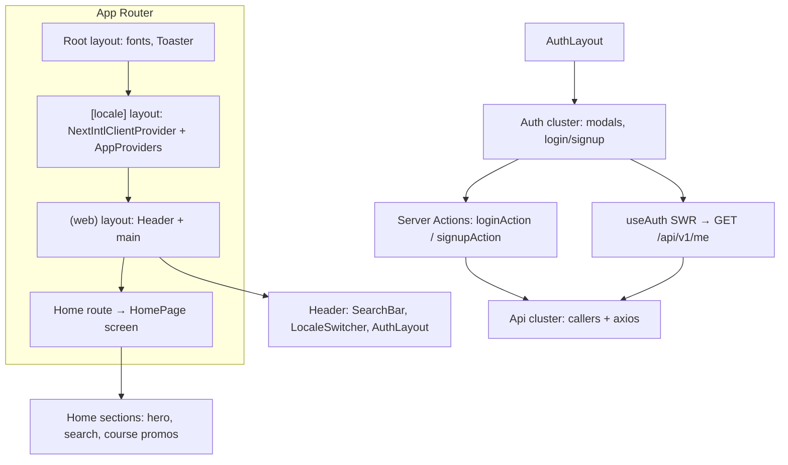

# Frontend architecture (fe)

This document describes how the **MyCourse** Next.js application is structured. It reflects the indexed knowledge graph for repo **`fe`** (functional clusters: **Ui**, **Api**, **Auth**) and the current source layout.

## Stack

| Layer | Choice |
|--------|--------|
| Framework | Next.js **16** (App Router) |
| UI | React **19**, Tailwind CSS **4**, Radix-based UI primitives (`src/components/ui`) |
| Forms & validation | `react-hook-form`, `zod`, `@hookform/resolvers` |
| i18n | `next-intl` — locales `en` and `vi`, default `vi`, **always** use locale prefix in URLs |
| Data fetching (client) | `swr` (global defaults in `AppProviders`) |
| HTTP | `axios` via a shared instance (`src/api/instance.ts`) |
| Global state | `zustand` (auth modal, API error accumulation, app store) |
| Notifications | `sonner` (root layout) |

## High-level layout

## Directory map (conceptual)

| Area | Path | Role |
|------|------|------|
| App entry | `src/app/` | Routes, root and locale layouts |
| Feature screens | `src/screen/` | Composed pages (e.g. `screen/home/page.tsx`) |
| Shared UI | `src/components/` | `common/` (header, footer, auth menu), `home/`, `shared/`, `ui/` |
| API layer | `src/api/` | `instance.ts` (interceptors, refresh), `methods.ts`, `callers/`, `hooks/`, optional `cache.ts` |
| Server actions | `src/actions/` | `"use server"` actions (auth cookies, etc.) |
| State | `src/store/` | Zustand stores |
| Hooks | `src/hooks/` | App hooks (e.g. auth context helpers) |
| i18n | `src/i18n/` | `routing.ts`, `request.ts` (loaded by `next.config.ts` plugin), `navigation.ts` |
| Messages | `src/messages/*.json` | Translation catalogs |
| Config / constants | `src/config/`, `src/constants/` | Feature config, route names, API path constants |
| Types & schemas | `src/types/`, `src/schema/` | Shared TS types and Zod schemas |

## Functional clusters (GitNexus)

The graph groups the codebase into cohesive modules:

- **Auth** — Login and signup UI (`LoginContent`, `SignupContent`, `LoginSignupPopup`, `AuthButton`, `AuthLayout`), `handleAuthSubmit`, server actions `loginAction` / `signupAction`, cookie helpers used by auth, and hooks that tie UI to `/me` and SWR.
- **Api** — `createApiInstance`, token refresh (`doTokenRefresh`, queue flush), `apiFetch` / `apiPost` / `apiPut` / `apiDelete`, header/cookie parsing, and lightweight client cache helpers.
- **Ui** — Design-system and layout primitives (`Button`, `Dialog`, `Field`, `Card`, …), `cn()` utilities, and other presentational building blocks.

## Internationalization

- Routing config: `src/i18n/routing.ts` (`defineRouting`: `locales`, `defaultLocale: "vi"`, `localePrefix: "always"`).
- Request config and message loading: `src/i18n/request.ts`, wired through `createNextIntlPlugin` in `next.config.ts`.
- The root page `src/app/page.tsx` redirects into the default locale via `src/i18n/navigation`.
- Validation copy often uses message **keys** resolved with `next-intl` in components (see README / auth forms).

## API integration

- **Base URL**: `NEXT_PUBLIC_API_URL` (see `deploy.md`).
- **Route constants**: `src/constants/api-route.ts` — public auth paths (`/api/v1/auth/login`, signup, refresh) and private `GET /api/v1/me`.
- **Server vs client**: Login/signup use **server actions** so the browser does not call the login API directly; tokens are written from the action using `next/headers`. Client calls (e.g. `getMe`) use the Axios instance with cookies / interceptors.

## Middleware / locale handling

`src/proxy.ts` defines the **next-intl** middleware (`createMiddleware(routing)`) and a `matcher`. For Next.js to execute it, the file must satisfy the framework’s middleware filename/location convention (typically `middleware.ts` at the project root or under `src/`). If locale-prefixed URLs are not enforced in your environment, verify that this file is actually registered as Next.js middleware.

## Related docs

- `docs/flow.md` — Auth and API execution flows (aligned with GitNexus **process** traces).
- `docs/screens.md` — Routes and main UI surfaces.
- `docs/deploy.md` — Build, env vars, and hosting notes.
