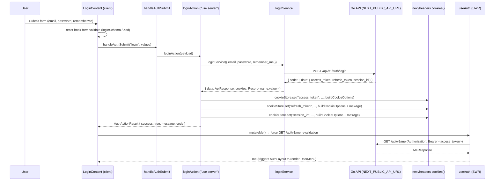
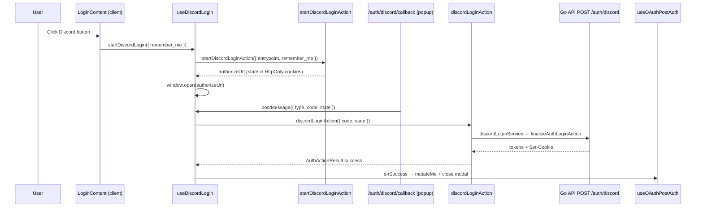
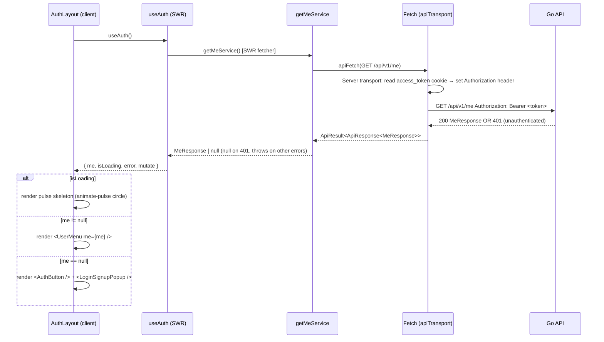
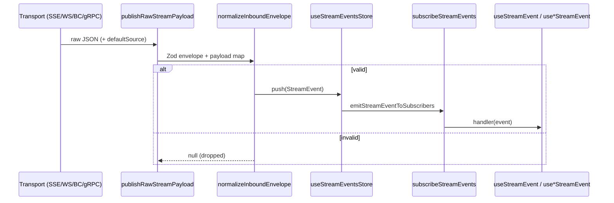

# Execution Flows (`fe`)

_Last audited: 2026-07-09 (OAuth callback middleware bypass for locale-less popup routes). Prior: 2026-07-08 (Discord + Google OAuth on popup; X code retained)._


This document traces the major user-visible and technical flows in the MyCourse frontend. Flows are derived from the **GitNexus** process index for repo **`fe-mycourse`** (12 tracked execution chains across the **Auth** and **Api** clusters) and from direct source inspection. Regenerate the graph after large UI changes with `npx gitnexus analyze --force` from the **fe-mycourse** repo root.

The **(web) layout** (`src/app/[locale]/(web)/layout.tsx`) wraps every marketing page in `Header` → `<main>` → `Footer`; the flows below focus on **auth** and **API** unless otherwise noted.

---

## Overview of Tracked Processes

GitNexus currently indexes 12 execution flows, grouped into two categories:

| Flow category | Processes | Type |
|---------------|-----------|------|
| Login submit chain | OnSubmit → LoginService, OnSubmit → GetCookieDomain, OnSubmit → BuildCookieOptions | cross-community |
| Signup submit chain | OnSubmit → SignupAction | intra-community |
| Auth UI wiring | LoginContent → UseAuth, SignupContent → HandleSearch, RegisterForm → HandleSearch | intra/cross-community |

---

## 1. Login Flow

**Goal:** Validate credentials, obtain tokens, persist cookies, and refresh the UI — without exposing the login HTTP call in the browser network panel.

### 1.1 Sequence



### 1.2 Step-by-step

**Step 1 — Form validation (`LoginContent`)**

`src/components/common/auth-menu/auth/login-content.tsx`

`react-hook-form` with `zodResolver(loginSchema)`. The schema (`src/schema/auth/auth.ts`) validates:
- `email`: non-empty, valid email format
- `password`: non-empty
- `rememberMe`: boolean

Validation error messages are i18n keys (e.g. `"validation.email"`); `auth-form-fields.tsx` resolves them via `useTranslations("auth")` only when `error.message` is defined.

**Step 2 — Dispatch to server action (`handleAuthSubmit`)**

`src/actions/auth/auth-client.ts`

Shared dispatcher called by both `LoginContent` and `SignupContent`:

```ts
handleAuthSubmit("login", loginValues)   // → loginAction
handleAuthSubmit("signup", signupValues, locale) // → registerAction({ locale })
```

**Step 3 — Server Action (`loginAction`)**

`src/actions/auth/auth.ts` — marked `"use server"`.

- Calls `loginService(payload)` which issues `POST /api/v1/auth/login` **from the Next.js server** (not the browser).
- The Go API returns `{ code, message, data: { access_token, refresh_token, session_id } }`.
- Server Action parses **BE `Set-Cookie` Max-Age** from the login/confirm response and passes it to `setAuthSessionCookies`:

```ts
const { data: response, setCookieHeaders } = await loginService(payload);
await setAuthSessionCookies({
  tokens: { access_token, refresh_token, session_id },
  refreshMaxAge: refreshMaxAgeFromBeSetCookie(setCookieHeaders),
});
```

TTL is **not** hardcoded on FE — it comes from BE `Set-Cookie`. Fallback: `auth_session_expires_at` stores absolute expiry (Unix seconds); remaining Max-Age = `expires_at - now`.

**Step 4 — Cookie strategy**

`buildAuthCookieOptions` (from `src/lib/utils/cookie.ts`) produces **HttpOnly**, `SameSite=Lax` auth cookies via Server Actions:

| Attribute | Value | Reason |
|-----------|-------|--------|
| `httpOnly` | `true` | JS cannot read tokens — reduces XSS token theft |
| `sameSite` | `lax` | Prevents CSRF while allowing top-level navigation redirects |
| `secure` | `true` (production) | Forces HTTPS-only transmission |
| `domain` | parent domain (e.g. `yourdomain.net`) | Allows cookies to be sent to `api.yourdomain.net` when FE and API are on separate subdomains. Controlled by `AUTH_COOKIE_DOMAIN` env var. |
| `maxAge` | — (`access_token`), refresh/session from BE Set-Cookie Max-Age | Parsed by BFF; fallback `auth_session_expires_at` |

**Client API calls:** browser transport uses `credentials: "include"`. The browser sends HttpOnly cookies; the Go backend reads `access_token` from the cookie when no `Authorization` header is present. **Server-side** Next.js still reads HttpOnly cookies via `next/headers` and attaches `Authorization: Bearer …`.

**After silent refresh (client):** FE proxy reads BE `Set-Cookie` Max-Age; if unavailable, uses `auth_session_expires_at` (last value from BE).

**Step 5 — SWR revalidation**

After a successful login, `login-content.tsx` calls **`mutateMe()`** from `useGetMe()` (Zustand mirror synced from SWR). This forces an immediate `GET /api/v1/me` with the new cookies; `AuthLayout` switches from `AuthButton` to `UserMenu`.

**Errors in UI:** `translateApiErrorCode(useTranslations("errors.codes"), result.code)` — never `result.message`.

---

## 1b. Social OAuth Login Flow (Discord + Google on popup)

**Goal:** Sign in via Discord or Google from the login/signup modal without exposing OAuth token exchange in the browser network panel. X OAuth code remains in the repo but is **not** wired to the popup.

> **Popup UI:** `AuthSocialLogin` shows **Discord + Google** only.

> **Callback routing:** Provider `redirect_uri` is locale-less (`/auth/discord/callback`, `/auth/x/callback`). `src/proxy.ts` matcher excludes these paths so next-intl does not redirect to `/{locale}/auth/...` (404 → popup never completes login). See `docs/router.md` § Middleware.

### Discord sequence



### Google (popup)

`useGoogleLogin` → GSI code client → `googleLoginAction` → `finalizeAuthLoginAction` → `useOAuthPostAuth` (same post-auth path as Discord).

Detail: [`docs/api-using.md`](./api-using.md), [`docs/screens.md`](./screens.md).

---

## 2. Register (Signup) Flow

**Goal:** Create a pending user and send a confirmation email — no login until email is confirmed.

```
SignupContent (client, locale from useLocale())
  → handleAuthSubmit("signup", values, locale)
    → registerAction(payload)              ["use server"]
      → registerService(payload)           POST /api/v1/auth/register
        body: email, password, display_name, locale
      → 201: no cookies set
  → UI: registrationPending panel ("check your email"), modal stays open
```

**Errors in UI:** `translateApiErrorCode(useTranslations("errors.codes"), result.code)` — all auth codes via `errors.codes.{code}`; rate-limit `4010` keeps `Retry-After` countdown UX.

**Email link (BE):** `{APP_CLIENT_BASE_URL}/{locale}/confirm-email?token={uuid}` → see §2b.

---

## 2b. Email Confirm Flow

**Goal:** User clicks email link → FE page confirms → session cookies set → redirect home.

```
GET /{locale}/confirm-email?token=...
  → ConfirmEmailContent (client, once)
    → confirmAction({ token })           ["use server"]
      → confirmService                   POST /api/v1/auth/confirm
      → setAuthSessionCookies (shared with login)
    → mutateMe() + broadcast confirm_success + router.replace("/")
```

**Other tabs:** Background tabs receive `confirm_success` via `BroadcastChannel`. If the tab is hidden, `useAuthConfirmTabSync` sets `sessionStorage` (`mycourse:pending_auth_tab_reload`). When the user focuses that tab, the page reloads so `/me` reflects the new session. The tab that performed confirm does not reload again.

---

## 2c. Logout Flow

**Goal:** User clicks Logout in `UserMenu` → dedicated page revokes BE session → cookies cleared → redirect home.

```
GET /{locale}/logout
  → LogoutContent (client, once)
    → logoutAction()                     ["use server"]
      → logoutService                    POST /api/v1/auth/logout (headers or HttpOnly cookies)
      → clearAuthSessionCookies
    → mutateMe() + broadcast logout + router.replace("/")
```

**Other tabs:** `useAuthLogoutTabSync` listens for `broadcast:logout`, calls `mutateMe()`, then `window.location.reload()`. HttpOnly cookies are cleared by the tab that ran `logoutAction` (domain-wide Set-Cookie delete).

---

## 3. Current User ("me") Loading

**Goal:** Render the correct header chrome (skeleton → `UserMenu` or `AuthButton`) based on session state.

### Sequence



### `useAuth` hook details

`src/api/hooks/auth/useAuth.ts` — SWR hook:

```ts
const { me, isLoading, error, mutate } = useAuth();
```

- **Key:** `getMeEndpointKey` = `"/api/v1/me"` (defined once in `src/api/callers/auth/auth-factory.ts (+ auth-browser.ts)`).
- **Hook options:** `useAuth` passes `shouldRetryOnError: false` and `revalidateOnFocus: true` in `useAuth.ts`. `AppProviders` renders `SWRConfig` with `revalidateOnFocus: false`, `dedupingInterval: 30_000ms`, and `errorRetryInterval: 180_000ms` (3 min — see `src/constants/swr.ts`); `MeSwrSync` calls `useSyncMeFromAuth` **inside** that provider so the `/me` SWR subscription shares the same context as the rest of the tree. Hooks that omit `shouldRetryOnError: false` retry on error at the 3-minute interval, not SWR’s default 5 seconds.
- **401 handling:** `getMeService` catches 401 and returns `null` instead of throwing, so SWR does not enter error state for unauthenticated users.

---

## 4. Authenticated API Calls and Token Refresh

**Goal:** Attach a valid `Authorization: Bearer` token to every request and silently rotate the token when it expires.

### 4.1 Authenticated request auth attach

Every authenticated request goes through `createApiTransport` / `apiTransport`:

```
Request
  └─ Server: transport reads access_token via next/headers and sets
      Authorization: Bearer <access_token>
  └─ Client: does not attach Authorization manually; browser sends HttpOnly cookies
      via credentials:include and BE reads access_token from cookie
  └─ If access_token cookie is missing / empty → no bearer context → BE returns 401 "missing bearer token"
```

### 4.2 Token refresh flow

Triggered when **all** of: HTTP `401` or `403`; request not already retried; and **either** `X-Token-Expired: true` **or** `401` with no outgoing non-empty Bearer.

```
Eligible 401/403?
  │
  ├─ already retried? → report + throw immediately
  │
  ├─ SERVER writable:
  │     rawPost BE refresh → validate three tokens → setAuthSessionCookies → retry once
  │     failure → throw original ApiHttpError with sanitized cause + report
  │
  ├─ SERVER readonly / no-context:
  │     throw ApiRefreshRequiredError (no report toast)
  │
  └─ BROWSER:
        join/create single-flight refresh
        POST `${origin}/api/auth/refresh` (absolute same-origin; credentials include)
        ├─ success → retry once with rotated access_token
        └─ failure → throw original ApiHttpError with sanitized cause + report

Transport throws (timeout/network/abort/parse/policy) before HTTP outcome
  → reportApiError then rethrow (reporter matrix)

Any other final 4xx/5xx → reportApiError → throw ApiHttpError
```

Server authenticated redirects (`followServerRedirects` in `src/api/core/fetch-core-redirect.ts`) follow only **301 / 302 / 303 / 307 / 308**. Other 3xx (including **304**) are returned as the final response and are not treated as Location hops. Hop validation/state updates are file-private helpers (`resolveRedirectTargetUrl`, `applyRedirectHopState`); intermediate bodies are **await**-cancelled via `releaseAbandonedRedirectBody`. Credential refresh uses `rawPostRefreshUpstream` (`redirect: "error"` + trusted origin); public `RawApiOptions` stays locked without those fields.

### 4.3 Refresh request format

```
Client path:
  POST /api/auth/refresh
  (FE proxy reads cookies server-side and forwards explicit headers to BE)

Server path:
  POST /api/v1/auth/refresh
  Headers:
    Content-Type: application/json
    X-Refresh-Token: <refresh_jwt>
    X-Session-Id:    <session_id>
```

The `session_id` does not change across rotations. Both `access_token` and `refresh_token` are rotated.

### 4.4 Cookie update after refresh

| Environment | Cookie update method |
|-------------|---------------------|
| Client (browser) | FE proxy `/api/auth/refresh` rewrites cookies via `setAuthSessionCookies` |
| Server (SSR / Server Action) | writable refresh → `setAuthSessionCookies` via `next/headers` |

BE and FE must use the **same** `AUTH_COOKIE_DOMAIN` (e.g. `yourdomain.net`) on hosted multi-subdomain setups.

---

## 5. Global Error Handling

**Goal:** Server observability for **abnormal** failures (sanitized); browser UI gets codes/toasts only — no custom Console API logs and no server-log leakage.

`reportApiError` in `src/api/transport/api-transport.ts` runs on transport throws and final HTTP failures. It:

1. **Skips expected noise** (no custom Console, no Zustand): guest `GET /api/v1/me` → 401; `ERR_BLOCKED_BY_CLIENT`; `ApiRefreshRequiredError`.
2. **Logs** other **4xx**, **5xx**, timeout, **abort**, **network** (non-blocked), **parse**, policy, replay: one entry per incident.
3. **Console `[API]`:** when **`isServer()` OR `NODE_ENV === "development"`** (sanitized). Production browser → **0** custom `[API]`.
4. **Browser Zustand:** same logged set → `useApiError.push` (not on server). `toastApiError` uses `code` → i18n; development may `console.debug({ code, message })`.

The `useApiError` Zustand store (`src/store/api-error-store.ts`) retains the last 20 **abnormal** errors. UI components can subscribe:

```ts
import { useApiError } from "@/store/api-error-store";
const { lastError, errors, clear, remove } = useApiError();
```

`ApiErrorEntry` shape:

```ts
interface ApiErrorEntry {
  id: string;          // crypto.randomUUID()
  statusCode: number;  // HTTP status (0 = network error)
  appCode: number;     // BE app-level code (mirrors be/pkg/errcode/codes.go), fallback 9999
  message: string;
  url: string;         // e.g. "/auth/login"
  method: string;      // "GET" | "POST" | "PUT" | "DELETE"
  timestamp: number;   // Date.now()
}
```

Global error store updates are applied on client path; server path reports to logs only.

---

## 6. Auth Modal State (Zustand)

**Goal:** Open and close login/signup modals from anywhere in the app without prop drilling.

`useAuthStore` (`src/store/auth/auth.ts`) is a provider-free Zustand store:

```ts
const { authAction, openLoginModal, openSignupModal, closeAllModals, nextLink } = useAuthStore();
```

| Action | Effect |
|--------|--------|
| `openLoginModal(nextPath?)` | Sets `authAction: "login"`, stores `nextPath` in `nextLink` |
| `openSignupModal(nextPath?)` | Sets `authAction: "signup"`, stores `nextPath` in `nextLink` |
| `closeAllModals()` | Resets `authAction: "none"`, clears `nextLink` |

`LoginSignupPopup` observes `authAction` to decide which tab to show and whether to be visible. `AuthButton` calls `openLoginModal()` when clicked.

**Post-auth redirect:** Store `nextLink` before triggering the modal; read it after successful login/signup to redirect the user to the intended page.

---

## 7. Isomorphic Cookie Utilities

`getCookieValue(name)` and `setCookieValue(name, value, options?)` in `src/lib/utils/cookie.ts` (imported as `@/lib/utils`) are isomorphic helpers used throughout:

| Context | Read (`getCookieValue`) | Write (`setCookieValue`) |
|---------|------------------------|--------------------------|
| Browser | `js-cookie` (`Cookies.get`) | `js-cookie` (`Cookies.set`) |
| Server Action / Route Handler | `next/headers` `cookies().get()` | `next/headers` `cookies().set()` |
| Pure RSC (read-only server) | `next/headers` `cookies().get()` | Silently skipped (no-op) |

`isServer()` from `src/lib/utils/runtime.ts` (re-export `@/lib/utils`) is the branch condition.

---

## 8. Stream Events Lifecycle

**Goal:** Ingest realtime JSON envelopes from multiple transports into one typed store and notify React hooks.

**Bootstrap:** `AppProviders` → `EventsStreamProvider` → `startStreamEventTransports()` on mount (cleanup on unmount).

### 8.1 Sequence (inbound)



### 8.2 WebSocket ping → pong

When the server sends `{ type: "ping", ... }`, `socket-transport.ts` automatically replies with `postSocketOutbound({ type: "pong", payload: { id } })` after the event is normalized. SSE only accepts inbound `pong` (no client send on SSE wire).

### 8.3 Outbound examples

| Channel | API | Typical use |
|---------|-----|-------------|
| Broadcast | `useSendBroadcastOutbound()` / `postBroadcastOutbound` | Logout sync, cross-tab confirm |
| WebSocket | `postSocketOutbound` | Client ping, app messages |
| SSE | — | No outbound on SSE connection |

Detail: [`delivery.md`](./delivery.md).

---

## 9. Search Flow (Stub)

GitNexus tracks three `HandleSearch` processes:

- **LoginContent → HandleSearch** (cross-community)
- **SignupContent → HandleSearch** (intra-community)
- **RegisterForm → HandleSearch** (intra-community)

These trace the `SearchBar` component (`src/components/shared/search-bar.tsx`) receiving focus or input events inside auth-related forms. The search functionality itself is a UI stub — no backend call is currently wired.

---

## Cross-Reference

| For details on… | See |
|-----------------|-----|
| Component structure and routes | [`docs/screens.md`](screens.md) |
| Folder layout and clusters | [`docs/architecture.md`](architecture.md) |
| Production env vars and cookies | [`docs/deploy.md`](deploy.md) |
| Realtime channels (WS, SSE, …) | [`docs/delivery.md`](delivery.md) |
| Go API token endpoints | [`be-mycourse/docs/deploy.md`](../../be-mycourse/docs/deploy.md) |
| Full README with code examples | [`README.md`](../README.md) |
