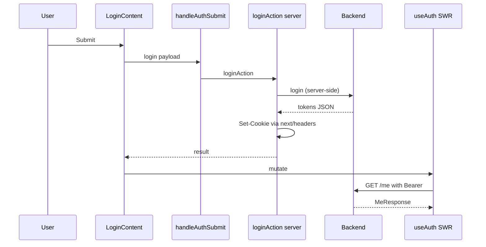

# Execution flows (fe)

User-visible and technical flows described from the **GitNexus** process index for repo **`fe`** and the current implementation. Processes are grouped around **auth submit** chains and **session / “me”** loading.

## Process index (summary)

GitNexus currently tracks **12** execution flows, including repeated variants of:

- **OnSubmit → LoginService** / **GetCookieDomain** / **BuildCookieOptions** (cross-module chains from form submit through server action and cookie utilities).
- **OnSubmit → SignupAction** (signup server action path).
- **LoginContent → UseAuth** (intra-module: login UI → hooks layering into `useAuth`).

These align with the **Auth** and **Api** clusters (login/signup UI, `handleAuthSubmit`, `loginAction` / `signupAction`, Axios instance, token refresh).

## Login (sign-in)

**Goal**: Validate credentials, obtain tokens, persist cookies, refresh the current user in the UI — without exposing the login HTTP call in the browser network panel for the API path.

**Happy path (conceptual)**:

1. **`LoginContent`** — User submits the form (`onSubmit` in `src/components/common/auth-menu/auth/login-content.tsx`).
2. **`handleAuthSubmit`** — Dispatches to `"login"` and calls the server action (`src/components/common/auth-menu/auth/auth-form-handler.ts`).
3. **`loginAction`** — Server action in `src/actions/auth/auth.ts` invokes **`loginService`** (`src/api/callers/auth/auth.ts`), reads tokens from the JSON body, sets **non-HttpOnly** cookies via `next/headers` using **`buildCookieOptions`** / **`getCookieDomain`** (`src/lib/utils.ts`).
4. UI calls **`mutate`** on the SWR cache (see README) so **`useAuth`** refetches **`GET /api/v1/me`**.

**GitNexus touchpoints**: symbols such as `onSubmit` (login), `handleAuthSubmit`, `loginAction`, `loginService`, plus cookie helpers in the cross-community **OnSubmit** processes.

## Signup (register)

**Goal**: Create an account through the same UX pattern as login.

1. **`SignupContent`** — Form submit → **`handleAuthSubmit("signup", …)`**.
2. **`signupAction`** — Server action calls the signup API and applies the same cookie strategy as login where applicable.

**GitNexus touchpoints**: **OnSubmit → SignupAction** processes and `signupAction` / `onSubmit` in `signup-content.tsx`.

## Current user (“me”) and header auth UI

**Goal**: Show a skeleton, **AuthButton**, or **UserMenu** based on session.

1. **`AuthLayout`** (`src/components/common/auth-menu/auth-layout.tsx`) uses **`useAuth`** from `src/api/hooks` (SWR + `getMeService`).
2. If loading → pulse placeholder; if **`me`** → **`UserMenu`**; else **`AuthButton`** + **`LoginSignupPopup`**.

An alternate convenience path documented in README is **`useGetMe`** wrapping **`useAuth`**; the header uses **`useAuth`** directly.

**GitNexus trace example**: **LoginContent → UseAuth** — steps: `LoginContent` → `useGetMe` → `useAuth` (illustrates the hook layering used across auth UI).

## Authenticated API calls & token refresh

**Goal**: Attach `Authorization: Bearer <access_token>` from cookies and recover from expiry without manual user retry when the backend signals rotation.

1. Request interceptor in **`createApiInstance`** reads cookies and sets headers.
2. On **401/403** with **`X-Token-Expired: true`**, the response path runs **`doTokenRefresh`**, calls **`POST /api/v1/auth/refresh`** with refresh + session headers, updates cookies, retries once (with a client-side mutex so concurrent requests share one refresh).

**Api cluster symbols** (GitNexus): `createApiInstance`, `doTokenRefresh`, `scheduleAfterRefresh`, `flushRefreshQueue`, `apiFetch`, `apiPost`, etc.

## Errors surfacing

Failed requests can push structured entries into the **Zustand** **`useApiError`** store from the Axios layer (`src/store/api-error-store.ts`) for global handling (e.g. toasts).

## Flow diagram (compact)

## Where to read more

- Root **`README.md`** — Detailed auth, refresh, and `ApiResult` behavior.
- **`docs/architecture.md`** — Folder layout and cluster overview.
- **`docs/screens.md`** — Which routes and components implement these flows in the UI.
