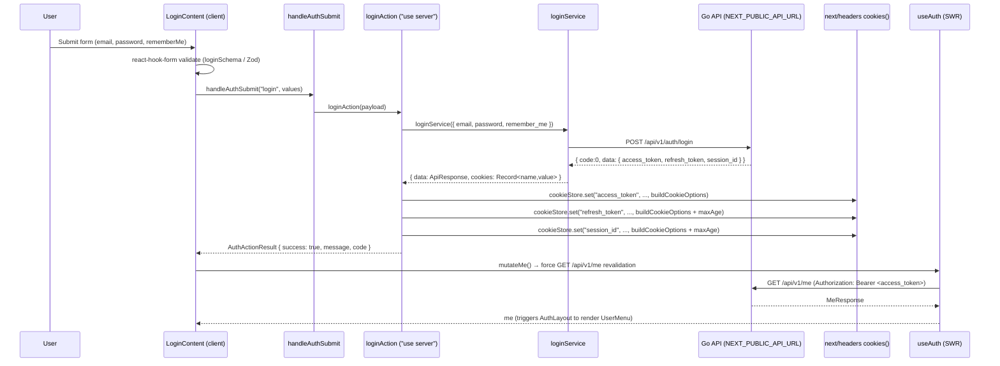
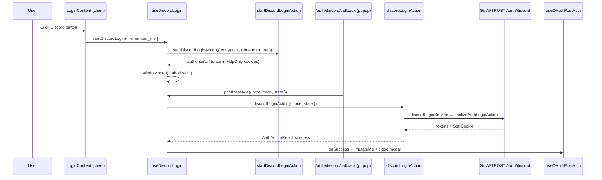
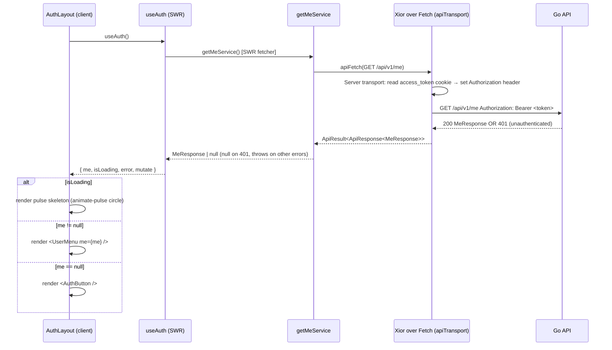
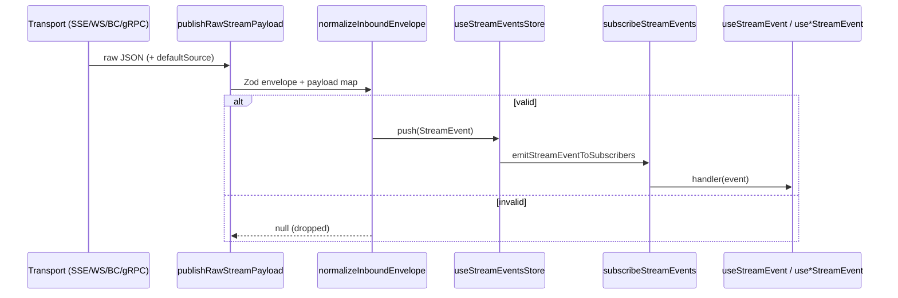

# Execution Flows (`fe`)

_Last audited: 2026-07-09 (OAuth callback middleware bypass for locale-less popup routes). Prior: 2026-07-08 (Discord + Google OAuth on popup; X code retained)._


This document traces the major user-visible and technical flows in the MyCourse frontend. Flows are derived from the **GitNexus** process index for repo **`fe-mycourse`** (12 tracked execution chains across the **Auth** and **Api** clusters) and from direct source inspection. Regenerate the graph after large UI changes with `npx gitnexus analyze --force` from the **fe-mycourse** repo root.

The **(web) layout** (`src/app/[locale]/(web)/layout.tsx`) wraps every marketing page in `Header` → `<main>` → `Footer`; the flows below focus on **auth** and **API** unless otherwise noted.

---

## Overview of Tracked Processes

GitNexus currently indexes 12 execution flows, grouped into two categories:

| Flow category | Processes | Type |
|---------------|-----------|------|
| Login submit chain | OnSubmit → LoginService, OnSubmit → GetCookieDomain, OnSubmit → BuildCookieOptions | cross-community |
| Signup submit chain | OnSubmit → SignupAction | intra-community |
| Auth UI wiring | LoginContent → UseAuth, SignupContent → HandleSearch, RegisterForm → HandleSearch | intra/cross-community |

---

## 1. Login Flow

**Goal:** Validate credentials, obtain tokens, persist cookies, and refresh the UI — without exposing the login HTTP call in the browser network panel.

### 1.1 Sequence


```mermaid
sequenceDiagram
  participant U as User
  participant LC as LoginContent (client)
  participant H as handleAuthSubmit
  participant SA as loginAction ("use server")
  participant LS as loginService
  participant API as Go API (NEXT_PUBLIC_API_URL)
  participant CK as next/headers cookies()
  participant SWR as useAuth (SWR)

  U->>LC: Submit form (email, password, rememberMe)
  LC->>LC: react-hook-form validate (loginSchema / Zod)
  LC->>H: handleAuthSubmit("login", values)
  H->>SA: loginAction(payload)
  SA->>LS: loginService({ email, password, remember_me })
  LS->>API: POST /api/v1/auth/login
  API-->>LS: { code:0, data: { access_token, refresh_token, session_id } }
  LS-->>SA: { data: ApiResponse, cookies: Record<name,value> }
  SA->>CK: cookieStore.set("access_token", ..., buildCookieOptions)
  SA->>CK: cookieStore.set("refresh_token", ..., buildCookieOptions + maxAge)
  SA->>CK: cookieStore.set("session_id", ..., buildCookieOptions + maxAge)
  SA-->>LC: AuthActionResult { success: true, message, code }
  LC->>SWR: mutateMe() → force GET /api/v1/me revalidation
  SWR->>API: GET /api/v1/me  (Authorization: Bearer <access_token>)
  API-->>SWR: MeResponse
  SWR-->>LC: me (triggers AuthLayout to render UserMenu)
```

### 1.2 Step-by-step

**Step 1 — Form validation (`LoginContent`)**

`src/components/common/auth-menu/auth/login-content.tsx`

`react-hook-form` with `zodResolver(loginSchema)`. The schema (`src/schema/auth/auth.ts`) validates:
- `email`: non-empty, valid email format
- `password`: non-empty
- `rememberMe`: boolean

Validation error messages are i18n keys (e.g. `"validation.email"`); `auth-form-fields.tsx` resolves them via `useTranslations("auth")` only when `error.message` is defined.

**Step 2 — Dispatch to server action (`handleAuthSubmit`)**

`src/actions/auth/auth-client.ts`

Shared dispatcher called by both `LoginContent` and `SignupContent`:

```ts
handleAuthSubmit("login", loginValues)   // → loginAction
handleAuthSubmit("signup", signupValues, locale) // → registerAction({ locale })
```

**Step 3 — Server Action (`loginAction`)**

`src/actions/auth/auth.ts` — marked `"use server"`.

- Calls `loginService(payload)` which issues `POST /api/v1/auth/login` **from the Next.js server** (not the browser).
- The Go API returns `{ code, message, data: { access_token, refresh_token, session_id } }`.
- Server Action parses **BE `Set-Cookie` Max-Age** from the login/confirm response and passes it to `setAuthSessionCookies`:

```ts
const { data: response, setCookieHeaders } = await loginService(payload);
await setAuthSessionCookies({
  tokens: { access_token, refresh_token, session_id },
  refreshMaxAge: refreshMaxAgeFromBeSetCookie(setCookieHeaders),
});
```

TTL is **not** hardcoded on FE — it comes from BE `Set-Cookie`. Fallback: `auth_session_expires_at` stores absolute expiry (Unix seconds); remaining Max-Age = `expires_at - now`.

**Step 4 — Cookie strategy**

`buildAuthCookieOptions` (from `src/lib/utils/cookie.ts`) produces **HttpOnly**, `SameSite=Lax` auth cookies via Server Actions:

| Attribute | Value | Reason |
|-----------|-------|--------|
| `httpOnly` | `true` | JS cannot read tokens — reduces XSS token theft |
| `sameSite` | `lax` | Prevents CSRF while allowing top-level navigation redirects |
| `secure` | `true` (production) | Forces HTTPS-only transmission |
| `domain` | parent domain (e.g. `yourdomain.net`) | Allows cookies to be sent to `api.yourdomain.net` when FE and API are on separate subdomains. Controlled by `AUTH_COOKIE_DOMAIN` env var. |
| `maxAge` | — (`access_token`), refresh/session from BE Set-Cookie Max-Age | Parsed by BFF; fallback `auth_session_expires_at` |

**Client API calls:** browser transport uses `credentials: "include"`. The browser sends HttpOnly cookies; the Go backend reads `access_token` from the cookie when no `Authorization` header is present. **Server-side** Next.js still reads HttpOnly cookies via `next/headers` and attaches `Authorization: Bearer …`.

**After silent refresh (client):** FE proxy reads BE `Set-Cookie` Max-Age; if unavailable, uses `auth_session_expires_at` (last value from BE).

**Step 5 — SWR revalidation**

After a successful login, `login-content.tsx` calls **`mutateMe()`** from `useGetMe()` (Zustand mirror synced from SWR). This forces an immediate `GET /api/v1/me` with the new cookies; `AuthLayout` switches from `AuthButton` to `UserMenu`.

**Errors in UI:** `translateApiErrorCode(useTranslations("errors.codes"), result.code)` — never `result.message`.

---

## 1b. Social OAuth Login Flow (Discord + Google on popup)

**Goal:** Sign in via Discord or Google from the login/signup modal without exposing OAuth token exchange in the browser network panel. X OAuth code remains in the repo but is **not** wired to the popup.

> **Popup UI:** `AuthSocialLogin` shows **Discord + Google** only.

> **Callback routing:** Provider `redirect_uri` is locale-less (`/auth/discord/callback`, `/auth/x/callback`). `src/proxy.ts` matcher excludes these paths so next-intl does not redirect to `/{locale}/auth/...` (404 → popup never completes login). See `docs/router.md` § Middleware.

### Discord sequence


```mermaid
sequenceDiagram
  participant U as User
  participant LC as LoginContent (client)
  participant HD as useDiscordLogin
  participant SD as startDiscordLoginAction
  participant CB as /auth/discord/callback (popup)
  participant DA as discordLoginAction
  participant API as Go API POST /auth/discord
  participant PA as useOAuthPostAuth

  U->>LC: Click Discord button
  LC->>HD: startDiscordLogin({ remember_me })
  HD->>SD: startDiscordLoginAction({ entrypoint, remember_me })
  SD-->>HD: authorizeUrl (state in HttpOnly cookies)
  HD->>HD: window.open(authorizeUrl)
  CB->>HD: postMessage({ type, code, state })
  HD->>DA: discordLoginAction({ code, state })
  DA->>API: discordLoginService → finalizeAuthLoginAction
  API-->>DA: tokens + Set-Cookie
  DA-->>HD: AuthActionResult success
  HD->>PA: onSuccess → mutateMe + close modal
```

### Google (popup)

`useGoogleLogin` → GSI code client → `googleLoginAction` → `finalizeAuthLoginAction` → `useOAuthPostAuth` (same post-auth path as Discord).

Detail: [`docs/api-using.md`](./api-using.md), [`docs/screens.md`](./screens.md).

---

## 2. Register (Signup) Flow

**Goal:** Create a pending user and send a confirmation email — no login until email is confirmed.

```
SignupContent (client, locale from useLocale())
  → handleAuthSubmit("signup", values, locale)
    → registerAction(payload)              ["use server"]
      → registerService(payload)           POST /api/v1/auth/register
        body: email, password, display_name, locale
      → 201: no cookies set
  → UI: registrationPending panel ("check your email"), modal stays open
```

**Errors in UI:** `translateApiErrorCode(useTranslations("errors.codes"), result.code)` — all auth codes via `errors.codes.{code}`; rate-limit `4010` keeps `Retry-After` countdown UX.

**Email link (BE):** `{APP_CLIENT_BASE_URL}/{locale}/confirm-email?token={uuid}` → see §2b.

---

## 2b. Email Confirm Flow

**Goal:** User clicks email link → FE page confirms → session cookies set → redirect home.

```
GET /{locale}/confirm-email?token=...
  → ConfirmEmailContent (client, once)
    → confirmAction({ token })           ["use server"]
      → confirmService                   POST /api/v1/auth/confirm
      → setAuthSessionCookies (shared with login)
    → mutateMe() + broadcast confirm_success + router.replace("/")
```

**Other tabs:** Background tabs receive `confirm_success` via `BroadcastChannel`. If the tab is hidden, `useAuthConfirmTabSync` sets `sessionStorage` (`mycourse:pending_auth_tab_reload`). When the user focuses that tab, the page reloads so `/me` reflects the new session. The tab that performed confirm does not reload again.

---

## 2c. Logout Flow

**Goal:** User clicks Logout in `UserMenu` → dedicated page revokes BE session → cookies cleared → redirect home.

```
GET /{locale}/logout
  → LogoutContent (client, once)
    → logoutAction()                     ["use server"]
      → logoutService                    POST /api/v1/auth/logout (headers or HttpOnly cookies)
      → clearAuthSessionCookies
    → mutateMe() + broadcast logout + router.replace("/")
```

**Other tabs:** `useAuthLogoutTabSync` listens for `broadcast:logout`, calls `mutateMe()`, then `window.location.reload()`. HttpOnly cookies are cleared by the tab that ran `logoutAction` (domain-wide Set-Cookie delete).

---

## 3. Current User ("me") Loading

**Goal:** Render the correct header chrome (skeleton → `UserMenu` or `AuthButton`) based on session state.

### Sequence


```mermaid
sequenceDiagram
  participant AL as AuthLayout (client)
  participant UA as useAuth (SWR)
  participant GM as getMeService
  participant AX as Xior over Fetch (apiTransport)
  participant API as Go API

  AL->>UA: useAuth()
  UA->>GM: getMeService() [SWR fetcher]
  GM->>AX: apiFetch(GET /api/v1/me)
  AX->>AX: Server transport: read access_token cookie → set Authorization header
  AX->>API: GET /api/v1/me  Authorization: Bearer <token>
  API-->>AX: 200 MeResponse  OR  401 (unauthenticated)
  AX-->>GM: ApiResult<ApiResponse<MeResponse>>
  GM-->>UA: MeResponse | null  (null on 401, throws on other errors)
  UA-->>AL: { me, isLoading, error, mutate }

  alt isLoading
    AL->>AL: render pulse skeleton (animate-pulse circle)
  else me != null
    AL->>AL: render <UserMenu me={me} />
  else me == null
    AL->>AL: render <AuthButton />
  end
```

`AuthLayout` never mounts `LoginSignupPopup` itself — the guest branch renders only `<AuthButton />`, which links to `/login` / `/signup`. `LoginSignupPopup` is rendered solely by the `@modal` parallel-route slot (`src/app/[locale]/@modal/`) when `/login` or `/signup` is the active intercepted route; see §Route-Based Login/Signup Modal below.

### `useAuth` hook details

`src/api/hooks/auth/useAuth.ts` — SWR hook:

```ts
const { me, isLoading, error, mutate } = useAuth();
```

- **Key:** `getMeEndpointKey` = `"/api/v1/me"` (defined once in `src/api/callers/auth/auth-factory.ts (+ auth-browser.ts)`).
- **Hook options:** `useAuth` passes `shouldRetryOnError: false` and `revalidateOnFocus: true` in `useAuth.ts`. `AppProviders` renders `SWRConfig` with `revalidateOnFocus: false`, `dedupingInterval: 30_000ms`, and `errorRetryInterval: 180_000ms` (3 min — see `src/constants/swr.ts`); `MeSwrSync` calls `useSyncMeFromAuth` **inside** that provider so the `/me` SWR subscription shares the same context as the rest of the tree. Hooks that omit `shouldRetryOnError: false` retry on error at the 3-minute interval, not SWR’s default 5 seconds.
- **401 handling:** `getMeService` catches 401 and returns `null` instead of throwing, so SWR does not enter error state for unauthenticated users.
- **Cache persistence:** `SWRConfig`'s `provider` is `meCacheProvider` (`src/lib/swr/me-cache-provider.ts`), not SWR's plain default in-memory `Map`. It behaves identically for every other SWR key, but additionally persists the `/me` entry to `sessionStorage` on `beforeunload` and restores it on init — needed because the full-page `/login`↔`/signup` cross-link (§6) forces a hard navigation, which otherwise wipes the in-memory cache and makes the header flash "logged out" on every such reload while `/me` refetches. `meCacheProvider` is a **client-only singleton** — `SWRConfig` re-invokes its `provider` factory on every remount (notably React Fast Refresh in dev, which can't always preserve `AppProviders`' state), and without the singleton guard each remount registered another `beforeunload` listener that was never removed, leaking one per remount for the tab's whole lifetime. The server branch always returns a fresh, empty `Map` per request — a server-side singleton would leak one user's `/me` data into another user's SSR render, since the module stays loaded across requests.
- **On-mount revalidation, scoped skip:** `useAuth` reads the current route via `usePathname()` and computes `revalidateOnMount: !(isAuthRoutePath(pathname) && isMeCacheFresh(SWR_DEDUPING_INTERVAL_MS))`. On every route **except** `/login`/`/signup`, this is always `true` — SWR always fetches on mount (its default), even though `meCacheProvider` lets that mount paint instantly from the persisted cache. Only on `/login`/`/signup` themselves, and only when the persisted `/me` cache is less than 30 s old, does it skip the fetch — avoiding a redundant `/me` call on a fast bounce between those two full pages (each a hard nav — see §6). This is deliberately scoped that narrowly: an earlier, **unscoped** version (`revalidateOnMount: !isMeCacheFresh(...)` with no route check) skipped the fetch on *every* route, which let a revoked/expired session survive a reload of a protected page (e.g. `/instructor`) for the whole window — `e2e/tests/auth.spec.ts`'s "an expired/revoked session logs the user out on the next check" caught exactly this. Scoping the skip to `/login`/`/signup` only keeps that test passing (a reload of any other route always revalidates) while still avoiding the redundant call the visitor actually complained about.

---

## 4. Authenticated API Calls and Token Refresh

**Goal:** Attach a valid `Authorization: Bearer` token to every request and silently rotate the token when it expires.

### 4.1 Authenticated request auth attach

Every authenticated request goes through `createApiTransport` / `apiTransport`. The transport creates an isolated authenticated Xior 0.8.3 executor for that request; its request interceptor resolves runtime headers immediately before the native Fetch attempt, while the response interceptor preserves native success/non-2xx metadata for the existing policy layer:

```
Request
  └─ Server: Xior request interceptor asks the transport runtime for
      access_token via next/headers and sets
      Authorization: Bearer <access_token>
  └─ Client: does not attach Authorization manually; browser sends HttpOnly cookies
      via credentials:include and BE reads access_token from cookie
  └─ If access_token cookie is missing / empty → no bearer context → BE returns 401 "missing bearer token"
```

The interceptor does not refresh tokens. `ApiTransport` still owns refresh eligibility, browser single-flight, server capability checks, cookie rotation, reporter behavior and the single protected-request retry. This prevents Xior plugins from changing mutation or body-replay semantics.

### 4.2 Token refresh flow

Triggered when **all** of: HTTP `401` or `403`; request not already retried; and **either** `X-Token-Expired: true` **or** `401` with no outgoing non-empty Bearer.

```
Eligible 401/403?
  │
  ├─ already retried? → report + throw immediately
  │
  ├─ SERVER writable:
  │     rawPost BE refresh → validate three tokens → setAuthSessionCookies → retry once
  │     failure → throw original ApiHttpError with sanitized cause + report
  │
  ├─ SERVER readonly / no-context:
  │     throw ApiRefreshRequiredError (no report toast)
  │
  └─ BROWSER:
        join/create single-flight refresh
        POST `${origin}/api/auth/refresh` (absolute same-origin; credentials include)
        ├─ success → retry once with rotated access_token
        └─ failure → throw original ApiHttpError with sanitized cause + report

Transport throws (timeout/network/abort/parse/policy) before HTTP outcome
  → reportApiError then rethrow (reporter matrix)

Any other final 4xx/5xx → reportApiError → throw ApiHttpError
```

Server authenticated redirects (`followServerRedirects` in `src/api/core/fetch-core.ts`) follow only **301 / 302 / 303 / 307 / 308**. Other 3xx (including **304**) are returned as the final response and are not treated as Location hops. The file-private loop validates each Location and trusted origin, enforces visited/hop limits, applies status-specific method/body rewrites, and **awaits** intermediate body cancellation. Credential refresh uses `rawPostRefreshUpstream` (`redirect: "error"` + trusted origin); public `RawApiOptions` stays locked without those fields.

### 4.3 Refresh request format

```
Client path:
  POST /api/auth/refresh
  (FE proxy reads cookies server-side and forwards explicit headers to BE)

Server path:
  POST /api/v1/auth/refresh
  Headers:
    Content-Type: application/json
    X-Refresh-Token: <refresh_jwt>
    X-Session-Id:    <session_id>
```

The `session_id` does not change across rotations. Both `access_token` and `refresh_token` are rotated.

### 4.4 Cookie update after refresh

| Environment | Cookie update method |
|-------------|---------------------|
| Client (browser) | FE proxy `/api/auth/refresh` rewrites cookies via `setAuthSessionCookies` |
| Server (SSR / Server Action) | writable refresh → `setAuthSessionCookies` via `next/headers` |

BE and FE must use the **same** `AUTH_COOKIE_DOMAIN` (e.g. `yourdomain.net`) on hosted multi-subdomain setups.

---

## 5. Global Error Handling

**Goal:** Server observability for **abnormal** failures (sanitized); browser UI gets codes/toasts only — no custom Console API logs and no server-log leakage.

`reportApiError` in `src/api/transport/api-transport.ts` runs on transport throws and final HTTP failures. It:

1. **Skips expected noise** (no custom Console, no Zustand): guest `GET /api/v1/me` → 401; `ERR_BLOCKED_BY_CLIENT`; `ApiRefreshRequiredError`.
2. **Logs** other **4xx**, **5xx**, timeout, **abort**, **network** (non-blocked), **parse**, policy, replay: one entry per incident.
3. **Console `[API]`:** when **`isServer()` OR `NODE_ENV === "development"`** (sanitized). Production browser → **0** custom `[API]`.
4. **Browser Zustand:** same logged set → `useApiError.push` (not on server). `toastApiError` uses `code` → i18n; development may `console.debug({ code, message })`.

The `useApiError` Zustand store (`src/store/api-error-store.ts`) retains the last 20 **abnormal** errors. UI components can subscribe:

```ts
import { useApiError } from "@/store/api-error-store";
const { lastError, errors, clear, remove } = useApiError();
```

`ApiErrorEntry` shape:

```ts
interface ApiErrorEntry {
  id: string;          // crypto.randomUUID()
  statusCode: number;  // HTTP status (0 = network error)
  appCode: number;     // BE app-level code (mirrors be/pkg/errcode/codes.go), fallback 9999
  message: string;
  url: string;         // e.g. "/auth/login"
  method: string;      // "GET" | "POST" | "PUT" | "DELETE"
  timestamp: number;   // Date.now()
}
```

Global error store updates are applied on client path; server path reports to logs only.

---

## 6. Route-Based Login/Signup Modal

**Goal:** Open and close login/signup modals from anywhere in the app without prop drilling, purely via route navigation.

There is no `useAuthStore` / Zustand state for this anymore — opening the modal is a normal navigation to `/login` or `/signup`:

```ts
import { loginHref, signupHref } from "@/lib/navigation/routes";

<Link href={loginHref(nextPath)}>Log in</Link>
<Link href={signupHref(nextPath)}>Sign up</Link>
```

`loginHref` / `signupHref` (`src/lib/navigation/routes.ts`) build `/login?next=<nextPath>` / `/signup?next=<nextPath>` via the existing `buildQueryParams` helper (mirrors the existing `homeHref`/`logoutHref` pattern).

| Trigger | Href |
|---------|------|
| `AuthButton` (header CTA), on any page other than `/login`/`/signup` | `<Link href={loginHref(pathname)}>` / `<Link href={signupHref(pathname)}>` — current page via `usePathname()` (`@/i18n/navigation`) as `next`; soft nav, intercepted as a modal |
| `AuthButton`, while already on `/login`/`/signup` (`isAuthRoutePath(pathname)`) | Plain `<a href={loginHref()}>` / `<a href={signupHref()}>` (hard nav, no `next`, built via `getPathname` for the locale prefix) — a soft `Link` back to either would self-reference and get intercepted as a modal stacked on the very page it targets |
| `DashboardLayout` auto-redirect on `unauthorized` denial | `loginHref(<denied path>)`, 500ms after first rendering the denial state; tracked per-path in an in-memory `Set` (`autoPromptedPaths`, not `sessionStorage`) so it fires at most once per denied path per page load — a browser refresh clears it (re-arms the prompt), a dismiss-triggered remount (`router.back()`) does not |
| Switching forms inside the `LoginSignupPopup` modal (`LoginContent`/`SignupContent`'s default `variant="modal"`) | `<Link replace href={signupHref(nextPath)}>` / `loginHref(nextPath)` — soft nav, intercepted as the other modal |
| Switching forms on the full-page fallback (`LoginPageContent`/`SignupPageContent` pass `variant="page"`) | Plain `<a href>` (built via `getPathname`) instead of `Link` — a soft nav here would still get intercepted as a modal stacked on the full page it targets, which is exactly the "why does a modal show up when the signup page is already in front of me" bug this avoids |

A soft navigation to `/login` or `/signup` from anywhere in the app is intercepted as a modal overlay by the `@modal` parallel-route slot (`src/app/[locale]/@modal/`, rendered alongside `children` from `src/app/[locale]/layout.tsx`):

- `@modal/default.tsx` — returns `null` when no intercepted route is active.
- `@modal/(.)login/page.tsx`, `@modal/(.)signup/page.tsx` — each renders `<LoginSignupPopup type="login" | "signup" />` on top of whatever page the visitor was viewing.

This interception is unconditional for **any** soft (client-side) navigation matching the pattern — Next.js has no supported way to opt a specific `Link`/`router.push` call out of it. That is why every "I don't want a modal here" case above (`AuthButton` on an auth route, the full-page cross-link) is solved the same way: render a plain `<a href>` (a real, hard navigation) instead of `Link`, since only a hard load bypasses the interceptor.

A hard/direct navigation to the same URL with **no** `next` (refresh, shared link) instead renders the full page at `(web)/login/page.tsx` / `(web)/signup/page.tsx`, composing the same `LoginSignupLayout` + `LoginContent`/`SignupContent`. A hard/direct navigation that **does** carry a valid `next` is turned back into the intercepted-modal experience by the background bridge below, instead of staying as a plain page.

`LoginSignupPopup` no longer reads any store — it takes `type` as a prop and manages its own local `open` state. Closing sets `open=false` (letting the Radix Dialog exit animation play) then calls `router.back()` after the same delay.

**Already authenticated:** `useRedirectIfAuthenticated(nextPath)` (`src/hooks/auth/use-redirect-if-authenticated.ts`), called by both `LoginContent` and `SignupContent`, redirects to `nextPath ?? homeHref` via `router.replace` and renders `null` for that one frame instead of the form — but only when `useGetMe().me` was **already truthy on the first resolved check after mount**, snapshotted once and never re-evaluated. It deliberately does not react to a *later* guest→authenticated transition while mounted, since that's the login/signup this same form just performed (already handled by `onSubmit`'s own `onAuthenticated` callback) — an earlier version did react to it and raced that callback, recomputing `nextPath` as `null` after the URL had moved on and bouncing to `homeHref` instead of the real destination (caught via an e2e run where a learner's post-login redirect got hijacked).

**Post-auth redirect:** The `next` query param carries the intended destination. `useAuthNextParam()` (`src/hooks/auth/use-auth-next-param.ts`) reads it via `useSearchParams` and validates it with **both** `isSafeInternalPath` (same-origin check) **and** `isAuthRoutePath` (`src/lib/security/web/safe-redirect.ts`) — a `next` of `/login` or `/signup` itself is rejected too, not just a cross-origin one, since otherwise it self-propagates through every login/signup cross-link. `LoginContent`/`SignupContent` and `useOAuthPostAuth` all read the destination through this hook and hand it to the `onAuthenticated` callback supplied by `LoginSignupPopup`.

An invalid `next` is stripped from the address bar with a **raw `window.history.replaceState` call, not `router.replace`**. Going through the Next.js router here — even just to drop the query string on the same pathname — is itself a soft navigation, and `@modal`'s interception convention treats any soft navigation landing on `/login`/`/signup` as "entering the route from elsewhere," popping the modal open on top of the very page that is already rendering it (a hard-loaded `/login?next=<invalid>` would otherwise show the login form doubled: once as the full page, once as an unwanted modal over it). The raw History API updates the URL bar without triggering that interception.

**SWR cache across a hard nav:** the full-page login↔signup cross-link above forces a hard navigation, which tears down the whole JS runtime including SWR's normally in-memory-only cache. `meCacheProvider` (`src/lib/swr/me-cache-provider.ts`), passed as `AppProviders`' `SWRConfig` `provider`, additionally persists just the `/me` cache entry to `sessionStorage` (written on `beforeunload`, restored on init) so that reload shows the previously known auth state instantly instead of flashing "logged out" while SWR refetches. `useAuth` also skips the on-mount `/me` fetch itself, but **only** on `/login`/`/signup` and only when that persisted cache is less than `SWR_DEDUPING_INTERVAL_MS` old — a bounce between the two makes zero `/me` requests within that window instead of one per bounce. This is deliberately scoped to those two routes: an earlier, unscoped version skipped the fetch on every route, letting a revoked/expired session go undetected across a reload of a protected page — `e2e/tests/auth.spec.ts` caught that. See §3 below.

### 6.1 Background bridge for a hard-loaded modal

Next.js's `(.)login`/`(.)signup` interception only ever engages for a soft (client-side) navigation — there is no supported way to make a hard load render an intercepted route. `useAuthModalBackgroundBridge()` (`src/hooks/auth/use-auth-modal-background-bridge.ts`), mounted once app-wide via `AuthModalBackgroundBridge` in `AppProviders` (same "invisible sync component" pattern as `AuthConfirmTabSync`/`AuthLogoutTabSync`), retrofits that experience onto a hard load:

1. On its first effect run only (guarded by a ref, never repeats), if the current route is `/login`/`/signup` with a validated `next` (via `useAuthNextParam()`), it calls `router.replace(next)` — the background page's real content actually renders.
2. A second effect waits until `pathname` confirms that navigation has genuinely landed (not on a fixed timer or animation frame, which can fire before a slow RSC fetch/compile actually completes), then calls `router.push` back to the login/signup destination.
3. That second navigation is now a soft one away from an already-rendered page, so `@modal`'s interception applies — the modal opens over the real background page.

`next` is only ever a validated same-origin internal path (via `useAuthNextParam()`/`isSafeInternalPath`), so this never bounces to a cross-origin/external URL. A bare `/login`/`/signup` with no `next` is unaffected (nothing to bounce to). Any future route-modal-with-`next` feature can follow the same pattern.

---

## 7. Isomorphic Cookie Utilities

`getCookieValue(name)` and `setCookieValue(name, value, options?)` in `src/lib/utils/cookie.ts` (imported as `@/lib/utils`) are isomorphic helpers used throughout:

| Context | Read (`getCookieValue`) | Write (`setCookieValue`) |
|---------|------------------------|--------------------------|
| Browser | `js-cookie` (`Cookies.get`) | `js-cookie` (`Cookies.set`) |
| Server Action / Route Handler | `next/headers` `cookies().get()` | `next/headers` `cookies().set()` |
| Pure RSC (read-only server) | `next/headers` `cookies().get()` | Silently skipped (no-op) |

`isServer()` from `src/lib/utils/runtime.ts` (re-export `@/lib/utils`) is the branch condition.

---

## 8. Stream Events Lifecycle

**Goal:** Ingest realtime JSON envelopes from multiple transports into one typed store and notify React hooks.

**Bootstrap:** `AppProviders` → `EventsStreamProvider` → `startStreamEventTransports()` on mount (cleanup on unmount).

### 8.1 Sequence (inbound)


```mermaid
sequenceDiagram
  participant T as Transport (SSE/WS/BC/gRPC)
  participant P as publishRawStreamPayload
  participant N as normalizeInboundEnvelope
  participant Z as useStreamEventsStore
  participant S as subscribeStreamEvents
  participant H as useStreamEvent / use*StreamEvent

  T->>P: raw JSON (+ defaultSource)
  P->>N: Zod envelope + payload map
  alt valid
    N->>Z: push(StreamEvent)
    Z->>S: emitStreamEventToSubscribers
    S->>H: handler(event)
  else invalid
    N-->>P: null (dropped)
  end
```

### 8.2 WebSocket ping → pong

When the server sends `{ type: "ping", ... }`, `socket-transport.ts` automatically replies with `postSocketOutbound({ type: "pong", payload: { id } })` after the event is normalized. SSE only accepts inbound `pong` (no client send on SSE wire).

### 8.3 Outbound examples

| Channel | API | Typical use |
|---------|-----|-------------|
| Broadcast | `useSendBroadcastOutbound()` / `postBroadcastOutbound` | Logout sync, cross-tab confirm |
| WebSocket | `postSocketOutbound` | Client ping, app messages |
| SSE | — | No outbound on SSE connection |

Detail: [`delivery.md`](./delivery.md).

---

## 9. Search Flow (Stub)

GitNexus tracks three `HandleSearch` processes:

- **LoginContent → HandleSearch** (cross-community)
- **SignupContent → HandleSearch** (intra-community)
- **RegisterForm → HandleSearch** (intra-community)

These trace the `SearchBar` component (`src/components/shared/search-bar.tsx`) receiving focus or input events inside auth-related forms. The search functionality itself is a UI stub — no backend call is currently wired.

---

## Cross-Reference

| For details on… | See |
|-----------------|-----|
| Component structure and routes | [`docs/screens.md`](screens.md) |
| Folder layout and clusters | [`docs/architecture.md`](architecture.md) |
| Production env vars and cookies | [`docs/deploy.md`](deploy.md) |
| Realtime channels (WS, SSE, …) | [`docs/delivery.md`](delivery.md) |
| Go API token endpoints | [`be-mycourse/docs/deploy.md`](../../be-mycourse/docs/deploy.md) |
| Full README with code examples | [`README.md`](../README.md) |
